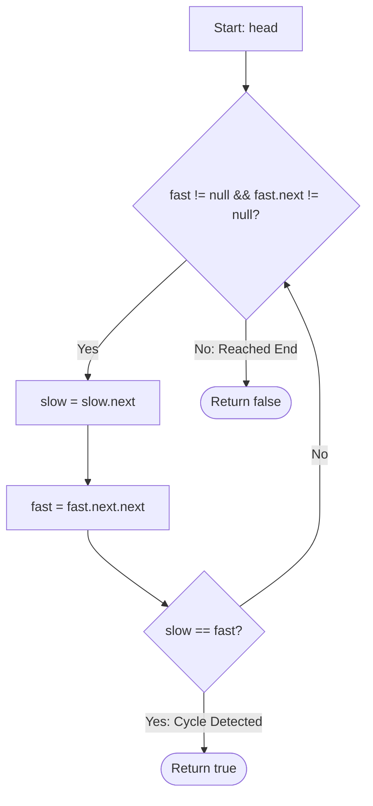

<h2><a href="https://leetcode.com/problems/linked-list-cycle">141. Linked List Cycle</a></h2>

<p>Given <code>head</code>, the head of a linked list, determine if the linked list has a cycle in it.</p>

<p>There is a cycle in a linked list if there is some node in the list that can be reached again by continuously following the&nbsp;<code>next</code>&nbsp;pointer. Internally, <code>pos</code>&nbsp;is used to denote the index of the node that&nbsp;tail's&nbsp;<code>next</code>&nbsp;pointer is connected to.&nbsp;<strong>Note that&nbsp;<code>pos</code>&nbsp;is not passed as a parameter</strong>.</p>

<p>Return&nbsp;<code>true</code><em> if there is a cycle in the linked list</em>. Otherwise, return <code>false</code>.</p>

<p>&nbsp;</p>
<p><strong class="example">Example 1:</strong></p>

<pre><strong>Input:</strong> head = [3,2,0,-4], pos = 1
<strong>Output:</strong> true
<strong>Explanation:</strong> There is a cycle in the linked list, where the tail connects to the 1st node (0-indexed).
</pre>

<p><strong class="example">Example 2:</strong></p>

<pre><strong>Input:</strong> head = [1,2], pos = 0
<strong>Output:</strong> true
<strong>Explanation:</strong> There is a cycle in the linked list, where the tail connects to the 0th node.
</pre>

<p><strong class="example">Example 3:</strong></p>

<pre><strong>Input:</strong> head = [1], pos = -1
<strong>Output:</strong> false
<strong>Explanation:</strong> There is no cycle in the linked list.
</pre>

<p>&nbsp;</p>
<p><strong>Constraints:</strong></p>

<ul>
	<li>The number of the nodes in the list is in the range <code>[0, 10<sup>4</sup>]</code>.</li>
	<li><code>-10<sup>5</sup> &lt;= Node.val &lt;= 10<sup>5</sup></code></li>
	<li><code>pos</code> is <code>-1</code> or a <strong>valid index</strong> in the linked-list.</li>
</ul>

<p>&nbsp;</p>
<p><strong>Follow up:</strong> Can you solve it using <code>O(1)</code> (i.e. constant) memory?</p>


---

# 🛍️ Linked-List-Cycle | Explained

## Approach 1: Floyd's Cycle-Finding Algorithm (Tortoise and Hare)
### Intuition
Imagine two runners on a track: a slow runner (the Tortoise) and a fast runner (the Hare). If the track is a straight path with a dead end, the fast runner will reach the end first, and the slow runner will never catch up. However, if the track is circular, the fast runner—moving at twice the speed of the slow runner—will eventually lap the slow runner from behind. 

In a singly-linked list, if a cycle exists, the list has no end (no node points to `null`). By traversing the list with two pointers moving at different speeds, they are guaranteed to meet at the exact same node if a cycle exists.

### Algorithm Visualized


### Approach
1. **Initialize pointers**: Create two pointers, `slow` and `fast`, both starting at the `head` of the linked list.
2. **Traverse the list**: Run a loop that continues as long as `fast` and `fast.next` are not `null`. This boundary check prevents null pointer exceptions.
3. **Advance pointers**: 
   - Move `slow` forward by one node (`slow = slow.next`).
   - Move `fast` forward by two nodes (`fast = fast.next.next`).
4. **Check for equality**: If at any point `slow` and `fast` point to the same node, a cycle has been detected. Return `true`.
5. **Termination**: If the loop exits because `fast` or `fast.next` becomes `null`, the list has a terminal end. Return `false`.

### Detailed Code Analysis
* **Lines 15-16 (`ListNode slow = head; ListNode fast = head;`)**: We initialize both traversal pointers at the entry point of the list. We use the original list nodes without duplicating any node data, ensuring minimal memory footprint.
* **Line 18 (`while(fast !=null && fast.next !=null)`)**: This condition is crucial. Because `fast` moves two steps at a time, we must verify that both the immediate next node (`fast`) and the node after that (`fast.next`) are valid. If either is `null`, we have reached the end of a linear list.
* **Lines 19-20 (`slow = slow.next; fast = fast.next.next;`)**: We update the positions of both pointers. `slow` shifts by 1 step, while `fast` shifts by 2 steps.
* **Line 22 (`if(slow == fast) return true;`)**: We check reference equality (object identity). If both variables refer to the exact same memory address, the fast pointer has looped back and caught up to the slow pointer, confirming a cycle.
* **Line 24 (`return false;`)**: If the loop conditions fail, it means we reached the tail of the list. Thus, no cycle exists.

### Code
```java
public class Solution {
    public boolean hasCycle(ListNode head) {
        
        ListNode slow = head;
        ListNode fast = head;

        while(fast != null && fast.next != null) {
            slow = slow.next;
            fast = fast.next.next;

            if(slow == fast) return true;
        }
        return false;
    }
}
```

### Complexity
- **Time:** $\mathcal{O}(N)$, where $N$ is the number of nodes in the linked list. 
  - If there is no cycle, the `fast` pointer reaches the end of the list in $N/2$ steps, which is $\mathcal{O}(N)$.
  - If there is a cycle, once the `slow` pointer enters the cycle, the distance between the two pointers decreases by 1 node at each step. The `fast` pointer will catch up to the `slow` pointer in at most $K$ steps (where $K$ is the length of the cycle, and $K \le N$). Thus, the overall run time remains linear.
- **Space:** $\mathcal{O}(1)$ auxiliary space. We only allocate memory for two pointer references (`slow` and `fast`), regardless of the size of the input list.

---

## 🕵️‍♂️ Follow-up Questions

### 1. How can you modify this algorithm to find the exact node where the cycle begins?
To find the start of the cycle, once `slow` and `fast` meet, leave one pointer at the meeting point and reset the other pointer back to the `head` of the list. Move both pointers forward at the exact same speed (one step at a time). The node where they meet again is the entry node of the cycle.

### 2. Can we solve this using a Hash Set, and what would be the trade-offs?
Yes. You can traverse the list and store each visited node's reference in a `HashSet`. If you encounter a node that is already present in the set, a cycle exists.
* **Trade-off:** This approach has a time complexity of $\mathcal{O}(N)$ but increases the space complexity to $\mathcal{O}(N)$ to store the node references, making the Floyd's pointer approach more space-efficient.