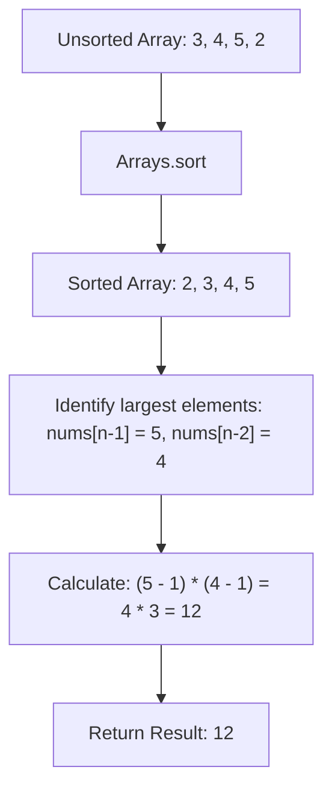

<h2><a href="https://leetcode.com/problems/maximum-product-of-two-elements-in-an-array">1464. Maximum Product of Two Elements in an Array</a></h2>

Given the array of integers <code>nums</code>, you will choose two different indices <code>i</code> and <code>j</code> of that array. <em>Return the maximum value of</em> <code>(nums[i]-1)*(nums[j]-1)</code>.
<p>&nbsp;</p>
<p><strong class="example">Example 1:</strong></p>

<pre><strong>Input:</strong> nums = [3,4,5,2]
<strong>Output:</strong> 12 
<strong>Explanation:</strong> If you choose the indices i=1 and j=2 (indexed from 0), you will get the maximum value, that is, (nums[1]-1)*(nums[2]-1) = (4-1)*(5-1) = 3*4 = 12. 
</pre>

<p><strong class="example">Example 2:</strong></p>

<pre><strong>Input:</strong> nums = [1,5,4,5]
<strong>Output:</strong> 16
<strong>Explanation:</strong> Choosing the indices i=1 and j=3 (indexed from 0), you will get the maximum value of (5-1)*(5-1) = 16.
</pre>

<p><strong class="example">Example 3:</strong></p>

<pre><strong>Input:</strong> nums = [3,7]
<strong>Output:</strong> 12
</pre>

<p>&nbsp;</p>
<p><strong>Constraints:</strong></p>

<ul>
	<li><code>2 &lt;= nums.length &lt;= 500</code></li>
	<li><code>1 &lt;= nums[i] &lt;= 10^3</code></li>
</ul>


---

# 🛍️ Maximum-Product-of-Two-Elements-in-an-Array | Explained

## Approach 1: Sorting
### Intuition
To maximize the product $(nums[i] - 1) \times (nums[j] - 1)$ where all array elements are positive, we need to choose the two largest numbers in the array. 

Imagine a podium at a sports tournament: if you want the highest combined score from two individual athletes, you simply select the gold medalist and the silver medalist. By sorting the array in ascending order, the two largest numbers automatically end up at the very end of the array, making them trivial to access.

### Algorithm Visualized


### Approach
1. Find the total length $n$ of the array.
2. Sort the array in non-decreasing order using `Arrays.sort()`.
3. Retrieve the two largest elements located at index $n - 1$ (the maximum) and index $n - 2$ (the second maximum).
4. Subtract `1` from each of these two values and calculate their product.
5. Return the resulting integer.

### Detailed Code Analysis
- **Line 3 (`int n = nums.length;`):** Stores the length of the input array `nums` in variable `n` to easily reference the last and second-to-last indices later.
- **Line 5 (`Arrays.sort(nums);`):** Sorts the primitive integer array in-place in ascending order. In Java, `Arrays.sort(int[])` uses a Dual-Pivot Quicksort algorithm.
- **Line 7 (`int ans = (nums[n-1]-1)*(nums[n-2]-1);`):** Accesses the largest element `nums[n-1]` and second-largest element `nums[n-2]`. Subtracts `1` from each per the problem specifications, multiplies them together, and stores the result in `ans`.
- **Line 9 (`return ans;`):** Returns the final calculated maximum product.

### Code
```java
class Solution {
    public int maxProduct(int[] nums) {
        int n = nums.length;

        Arrays.sort(nums);

        int ans = (nums[n-1]-1)*(nums[n-2]-1);

        return ans;
    }
}
```

### Complexity
- **Time:** $O(N \log N)$ where $N$ is the number of elements in `nums`. Sorting the array dominates the runtime complexity.
- **Space:** $O(\log N)$ auxiliary space required by the Dual-Pivot Quicksort implementation in Java for the recursion stack.

---

## 🕵️‍♂️ Follow-up Questions (Optional)

### 1. Can we optimize this solution to $O(N)$ time complexity?
**Answer:** Yes. Instead of sorting the entire array, we can iterate through the array once while keeping track of the two largest numbers (`max1` and `max2`). 

```java
public int maxProduct(int[] nums) {
    int max1 = 0;
    int max2 = 0;
    
    for (int num : nums) {
        if (num > max1) {
            max2 = max1;
            max1 = num;
        } else if (num > max2) {
            max2 = num;
        }
    }
    
    return (max1 - 1) * (max2 - 1);
}
```
This achieves $O(N)$ time complexity and $O(1)$ auxiliary space complexity.

### 2. How would this problem change if the array contained negative numbers?
**Answer:** If negative numbers were allowed, the product of two very large negative numbers (e.g., $-10 \times -10 = 100$) could yield a larger result than positive numbers. We would need to track both the two largest values and the two smallest values in a single pass.