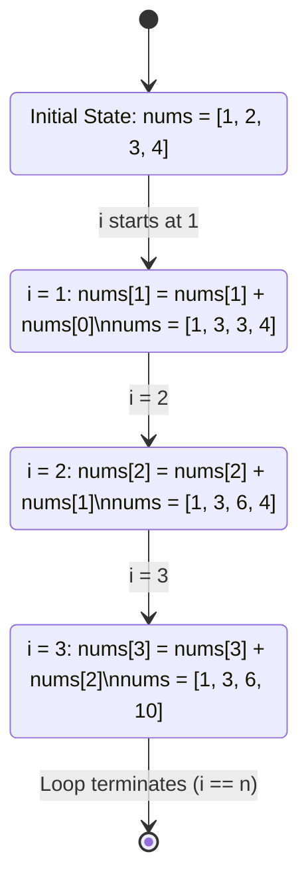

<h2><a href="https://leetcode.com/problems/running-sum-of-1d-array">1480. Running Sum of 1d Array</a></h2>

<p>Given an array <code>nums</code>. We define a running sum of an array as&nbsp;<code>runningSum[i] = sum(nums[0]…nums[i])</code>.</p>

<p>Return the running sum of <code>nums</code>.</p>

<p>&nbsp;</p>
<p><strong class="example">Example 1:</strong></p>

<pre><strong>Input:</strong> nums = [1,2,3,4]
<strong>Output:</strong> [1,3,6,10]
<strong>Explanation:</strong> Running sum is obtained as follows: [1, 1+2, 1+2+3, 1+2+3+4].</pre>

<p><strong class="example">Example 2:</strong></p>

<pre><strong>Input:</strong> nums = [1,1,1,1,1]
<strong>Output:</strong> [1,2,3,4,5]
<strong>Explanation:</strong> Running sum is obtained as follows: [1, 1+1, 1+1+1, 1+1+1+1, 1+1+1+1+1].</pre>

<p><strong class="example">Example 3:</strong></p>

<pre><strong>Input:</strong> nums = [3,1,2,10,1]
<strong>Output:</strong> [3,4,6,16,17]
</pre>

<p>&nbsp;</p>
<p><strong>Constraints:</strong></p>

<ul>
	<li><code>1 &lt;= nums.length &lt;= 1000</code></li>
	<li><code>-10^6&nbsp;&lt;= nums[i] &lt;=&nbsp;10^6</code></li>
</ul>


---

# 🛍️ Running-Sum-of-1d-Array | Explained

## Approach 1: In-Place Prefix Sum Modification
### Intuition
The core objective of this problem is to transform an array such that each element at index `i` contains the cumulative sum of all elements from index `0` to `i`. 

Rather than allocating a brand-new array and computing the sum from scratch for every index (which would result in an inefficient $O(N^2)$ brute-force solution), we can leverage a dynamic programming concept known as **Prefix Sums**. 

Think of this as a relay race: instead of each runner starting from the very beginning of the track, runner `i` simply takes the baton (the cumulative distance/sum) from runner `i-1` and adds their own distance (the value at `nums[i]`) to it. Because the element at `nums[i-1]` already contains the running sum of all elements prior to it, we can compute the next running sum in a single addition step:
$$\text{runningSum}[i] = \text{nums}[i] + \text{runningSum}[i-1]$$

By overwriting the input array `nums` directly, we achieve maximum space efficiency.

### Algorithm Visualized
The following state diagram traces how the input array `nums = [1, 2, 3, 4]` is modified in-place across each iteration of the loop:



### Approach
1. **Cache Array Length:** Store the length of the input array `nums` in a variable `n` to avoid fetching the array length property in every loop iteration.
2. **Iterative Accumulation:** Initialize a loop starting at index `1` (not `0`, as the first element's running sum is just itself) and iterate through to `n - 1`.
3. **In-Place Update:** At each index `i`, update `nums[i]` by adding the value of the previous element `nums[i-1]` to it.
4. **Return Results:** Once the loop completes, return the mutated `nums` array.

### Detailed Code Analysis
Let's analyze the exact code provided:

```java
1class Solution {
2    public int[] runningSum(int[] nums) {
3        int n= nums.length;
4        for(int i=1;i<n;i++){
5            nums[i] =nums[i]+nums[i-1];
6        }
7        return nums;
8    }
9   
10}
```

* **Line 3 (`int n = nums.length;`):** We query the array's metadata once and store its size in the local variable `n`. This prevents the JVM from repeatedly performing boundary checks against the array reference on every loop check `i < nums.length`.
* **Line 4 (`for(int i=1;i<n;i++)`):** 
  * The loop pointer `i` is explicitly initialized to `1`. This is vital because if `i` started at `0`, the expression `nums[i-1]` on line 5 would evaluate to `nums[-1]`, triggering an `ArrayIndexOutOfBoundsException`.
  * The loop condition `i < n` ensures we visit every element in the array exactly once.
* **Line 5 (`nums[i] =nums[i]+nums[i-1];`):** This is the engine of the algorithm. We are performing an in-place updates:
  * `nums[i-1]` represents the *already computed* running sum of elements from index `0` to `i-1`.
  * `nums[i]` represents the current raw element.
  * Adding them together and assigning the result back to `nums[i]` effectively transforms the raw element into the running sum at index `i`.
* **Line 7 (`return nums;`):** Because Java passes object references by value, modifying the `nums` array directly alters the underlying memory allocated for the array. We return the reference to the now-mutated array, satisfying the method signature with zero auxiliary memory allocated.

### Code
```java
class Solution {
    public int[] runningSum(int[] nums) {
        int n = nums.length;
        for (int i = 1; i < n; i++) {
            nums[i] = nums[i] + nums[i-1];
        }
        return nums;
    }
}
```

### Complexity
- **Time Complexity:** $\mathcal{O}(N)$
  We iterate through the array of size $N$ exactly once (starting from index $1$ to $N-1$). Inside the loop, we perform constant-time $\mathcal{O}(1)$ operations (addition and array assignment). Thus, the time complexity scales linearly with the size of the input array.

- **Space Complexity:** $\mathcal{O}(1)$ auxiliary space
  Because the algorithm mutates the input array `nums` in-place, we do not allocate any additional arrays, lists, or recursive stack frames. The only extra memory used is for the primitive integer loop variables (`n` and `i`), which consume constant storage.

---

## 🕵️‍♂️ Follow-up Questions

### 1. What are the engineering tradeoffs of mutating the input array in-place?
* **Pros:** 
  * **Memory Efficiency:** Achieving $\mathcal{O}(1)$ auxiliary space complexity is highly beneficial in memory-constrained environments (like embedded systems or high-throughput batch-processing pipelines) because it avoids garbage collection overhead.
* **Cons:**
  * **Side Effects (Loss of Original Data):** Mutating the input array destroys the original data. If another component of the application needs to read the original unmutated values of `nums` later, it will read the modified values instead, leading to bugs.
  * **Thread Safety:** If the input array is shared across multiple concurrent threads, mutating it in-place without proper synchronization will result in race conditions and undefined behavior.

### 2. How would you handle potential integer overflow?
If the elements in `nums` are very large (close to `Integer.MAX_VALUE`), adding them together will result in an arithmetic overflow, causing the values to wrap around to negative numbers in Java.
* **Solution:** To prevent this, the method signature would need to be changed to return a 64-bit integer array (`long[]`). The algorithm would then require allocating a new array to prevent overflow:
  ```java
  public long[] runningSum(int[] nums) {
      int n = nums.length;
      long[] result = new long[n];
      if (n == 0) return result;
      result[0] = nums[0];
      for (int i = 1; i < n; i++) {
          result[i] = result[i-1] + nums[i];
      }
      return result;
  }
  ```