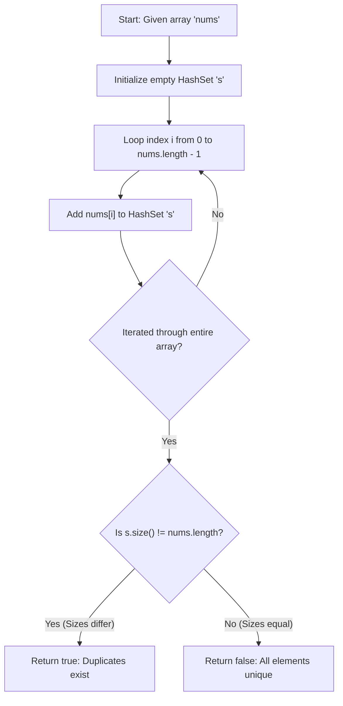

<h2><a href="https://leetcode.com/problems/contains-duplicate">217. Contains Duplicate</a></h2>

<p>Given an integer array <code>nums</code>, return <code>true</code> if any value appears <strong>at least twice</strong> in the array, and return <code>false</code> if every element is distinct.</p>

<p>&nbsp;</p>
<p><strong class="example">Example 1:</strong></p>

<div class="example-block">
<p><strong>Input:</strong> <span class="example-io">nums = [1,2,3,1]</span></p>

<p><strong>Output:</strong> <span class="example-io">true</span></p>

<p><strong>Explanation:</strong></p>

<p>The element 1 occurs at the indices 0 and 3.</p>
</div>

<p><strong class="example">Example 2:</strong></p>

<div class="example-block">
<p><strong>Input:</strong> <span class="example-io">nums = [1,2,3,4]</span></p>

<p><strong>Output:</strong> <span class="example-io">false</span></p>

<p><strong>Explanation:</strong></p>

<p>All elements are distinct.</p>
</div>

<p><strong class="example">Example 3:</strong></p>

<div class="example-block">
<p><strong>Input:</strong> <span class="example-io">nums = [1,1,1,3,3,4,3,2,4,2]</span></p>

<p><strong>Output:</strong> <span class="example-io">true</span></p>
</div>

<p>&nbsp;</p>
<p><strong>Constraints:</strong></p>

<ul>
	<li><code>1 &lt;= nums.length &lt;= 10<sup>5</sup></code></li>
	<li><code>-10<sup>9</sup> &lt;= nums[i] &lt;= 10<sup>9</sup></code></li>
</ul>


---

# 🛍️ Contains-Duplicate | Explained

## Approach 1: HashSet Bulk Insertion & Size Comparison
### Intuition
Imagine you are taking attendance in a classroom by asking every student to drop a personalized badge into a box. This box is special: it automatically destroys any duplicate badges that are identical to one already inside. 

If 10 students walk into the room, drop their badges in, and you end up with only 8 badges in the box, you immediately know that at least two students dropped duplicate badges. 

This approach uses a Hash Set—a data structure that inherently enforces uniqueness—to collect all elements from the array. By comparing the number of unique items collected in the set against the total number of elements in the original array, we can determine if any duplicates were discarded.

### Algorithm Visualized


### Approach
1. **Initialize Data Structure:** Create an empty `HashSet` of `Integer` objects to store unique numbers.
2. **Populate Set:** Iterate through every element in the `nums` array from index `0` to `nums.length - 1` using a standard `for` loop, adding each integer to the `HashSet`.
3. **Compare Collection Sizes:** After the loop finishes, retrieve the total count of unique elements stored in the set using `s.size()`.
4. **Evaluate Result:** Compare `s.size()` against `nums.length`.
   - If they are **not equal**, at least one duplicate element was suppressed during insertion $\rightarrow$ return `true`.
   - If they are **equal**, every element in `nums` was distinct $\rightarrow$ return `false`.

### Detailed Code Analysis

```java
class Solution {
    public boolean containsDuplicate(int[] nums) {
        Set<Integer> s = new HashSet<>();
        for(int i = 0; i < nums.length; i++){
            s.add(nums[i]);
        }
        return s.size() != nums.length;
    }
}
```

- **Line 3 (`Set<Integer> s = new HashSet<>();`):** 
  Instantiates a hash-table-backed `Set`. In Java, a `HashSet` is implemented internally using a `HashMap`. When adding items, automatic primitive boxing occurs, converting `int` primitives into `Integer` object wrappers.
  
- **Lines 4–6 (`for(int i=0; i<nums.length; i++) { s.add(nums[i]); }`):**
  This loop runs unconditionally $N$ times (where $N =$ `nums.length`). For each iteration, `nums[i]` is hashed and added to the set via `s.add()`. If `nums[i]` already exists in `s`, the underlying map replaces the value without increasing its key set size. 

- **Line 7 (`return s.size() != nums.length;`):**
  Queries the internal size property of the `HashSet` ($O(1)$ time complexity) and performs a boolean comparison against the primitive array length `nums.length`.

> **Engineering Note:** While this solution is correct and concise, notice that it always processes the **entire** array before making a decision. If an array has 1,000,000 elements and the very first two numbers are duplicates `[7, 7, ...]`, this code still iterates through all 1,000,000 elements and allocates space for all of them instead of exiting early on index 1.

### Code
```java
class Solution {
    public boolean containsDuplicate(int[] nums) {
        Set<Integer> s = new HashSet<>();
        for(int i = 0; i < nums.length; i++){
            s.add(nums[i]);
        }
        return s.size() != nums.length;
    }
}
```

### Complexity
- **Time Complexity:** $\mathcal{O}(N)$
  Adding an element to a `HashSet` takes amortized $\mathcal{O}(1)$ time. Since we loop through all $N$ elements in the array once, total insertion time is $\mathcal{O}(N)$. The final size check `s.size()` runs in $\mathcal{O}(1)$ time. Thus, total time complexity is $\mathcal{O}(N)$.

- **Space Complexity:** $\mathcal{O}(N)$
  In the worst-case scenario (where all elements in `nums` are completely unique), the `HashSet` will grow to store $N$ distinct `Integer` objects, requiring $\mathcal{O}(N)$ auxiliary memory.

---

## 🕵️‍♂️ Follow-up Questions

### 1. How can we optimize this approach to achieve early termination (short-circuiting)?
**Answer:** Instead of adding all elements to the set first and comparing sizes at the end, we can check the return value of `Set.add()` during the iteration loop. In Java, `Set.add(element)` returns `false` if the element is already present in the set. 

```java
public boolean containsDuplicate(int[] nums) {
    Set<Integer> s = new HashSet<>();
    for (int num : nums) {
        if (!s.add(num)) {
            return true; // Duplicate found immediately!
        }
    }
    return false;
}
```
This reduces the average-case execution time significantly when duplicates occur near the beginning of the array, while maintaining $\mathcal{O}(N)$ worst-case time complexity.

### 2. How would you solve this if memory is strictly limited ($\mathcal{O}(1)$ extra space)?
**Answer:** If extra heap allocation is prohibited, we can sort the array in-place first ($\mathcal{O}(N \log N)$ time using Dual-Pivot Quicksort or Timsort) and then perform a single linear scan ($\mathcal{O}(N)$) to check if any adjacent elements are equal (`nums[i] == nums[i - 1]`). This trades execution speed for optimal $\mathcal{O}(1)$ auxiliary space complexity.