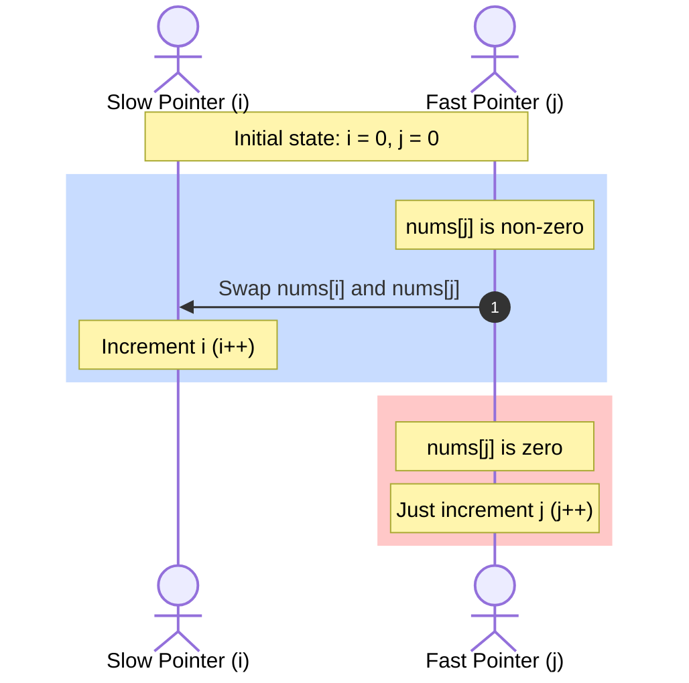

<h2><a href="https://leetcode.com/problems/move-zeroes">283. Move Zeroes</a></h2>

<p>Given an integer array <code>nums</code>, move all <code>0</code>'s to the end of it while maintaining the relative order of the non-zero elements.</p>

<p><strong>Note</strong> that you must do this in-place without making a copy of the array.</p>

<p>&nbsp;</p>
<p><strong class="example">Example 1:</strong></p>
<pre><strong>Input:</strong> nums = [0,1,0,3,12]
<strong>Output:</strong> [1,3,12,0,0]
</pre><p><strong class="example">Example 2:</strong></p>
<pre><strong>Input:</strong> nums = [0]
<strong>Output:</strong> [0]
</pre>
<p>&nbsp;</p>
<p><strong>Constraints:</strong></p>

<ul>
	<li><code>1 &lt;= nums.length &lt;= 10<sup>4</sup></code></li>
	<li><code>-2<sup>31</sup> &lt;= nums[i] &lt;= 2<sup>31</sup> - 1</code></li>
</ul>

<p>&nbsp;</p>
<strong>Follow up:</strong> Could you minimize the total number of operations done?

---

# 🛍️ Move-Zeroes | Explained

## Approach 1: Two-Pointer Overwrite & Fill (Two-Pass)

### Intuition
Imagine you are sorting a shelf of books. Some slots are empty (represented by zeroes), and others have books (non-zero numbers). Instead of swapping books back and forth, you can simply take all the books off the shelf and place them one by one starting from the very first slot on the left, completely ignoring the empty spaces. Once you've placed all the books, any remaining empty slots at the end of the shelf are filled with empty bookends (zeroes).

This is a two-pointer approach where:
1. One pointer (`i`) scans the entire array to find non-zero elements.
2. A second pointer (`j`) tracks where the next non-zero element should be written.
3. Once all non-zero elements are written, we fill the rest of the array with zeroes.

### Algorithm Visualized
```mermaid
graph TD
    Start([Start: i = 0, j = 0]) --> Loop{i < n?}
    Loop -- Yes --> Check{nums[i] == 0?}
    Check -- Yes --> IncI[i++] --> Loop
    Check -- No --> Copy["nums[j] = nums[i]"] --> IncBoth["i++, j++"] --> Loop
    Loop -- No --> FillZero["Loop: k = j to n-1<br>nums[k] = 0"] --> End([End])
```

### Approach
1. Initialize a read pointer `i` and a write pointer `j` both to `0`.
2. Iterate `i` through the array from `0` to `n - 1`.
3. If `nums[i]` is non-zero:
   - Copy the value of `nums[i]` to `nums[j]`.
   - Increment `j`.
4. If `nums[i]` is zero, do nothing except increment `i` (implicitly handled by the loop).
5. Once `i` reaches the end of the array, all non-zero elements have been compacted to the front of the array up to index `j - 1`.
6. Run a secondary loop starting from `j` to `n - 1` and set all these positions to `0`.

### Detailed Code Analysis
Let's analyze this specific implementation line-by-line:

```java
int n = nums.length;
int i = 0;
int j = 0;
```
* **Line 2-4:** We cache the length of the array in variable `n` to avoid redundant method calls. We initialize our read pointer `i` and write pointer `j` to `0`.

```java
while (i < n) {
    if (nums[i] == 0) {
        i++;
    } else {
        nums[j] = nums[i];
        i++;
        j++;
    }
}
```
* **Line 7-15:** This is the compaction phase. 
  * If `nums[i]` is a zero, we simply increment `i` to skip it.
  * If `nums[i]` is a non-zero, we copy it over to the write index `nums[j]`, then increment both pointers. This ensures that non-zero elements maintain their relative order while sliding to the left.

```java
for (int k = j; k < n; k++) {
    nums[k] = 0;
}
```
* **Line 16-18:** This is the zero-filling phase. After the `while` loop, the `j` pointer points to the first position after the last copied non-zero element. We fill all indices from `j` to `n - 1` with `0` to clear out the old remaining values.

### Code
```java
class Solution {
    public void moveZeroes(int[] nums) {
        int n = nums.length;
        int i = 0;
        int j = 0;

        while (i < n) {
            if (nums[i] == 0) {
                i++;
            } else {
                nums[j] = nums[i];
                i++;
                j++;
            }
        }
        for (int k = j; k < n; k++) {
            nums[k] = 0;
        }
    }
}
```

### Complexity
- **Time:** $\mathcal{O}(N)$ where $N$ is the number of elements in the array. We make exactly one pass over the array with pointer `i`, and a partial second pass to fill zeroes. The total operations are bounded by $2N$.
- **Space:** $\mathcal{O}(1)$ auxiliary space. All operations are done in-place without allocating any extra data structures.

---

## Approach 2: In-Place Swapping (Partitioning / Active Solution)

### Intuition
This approach is based on the **Quicksort partition scheme**. Instead of copying values and then filling zeroes in a separate pass, we can solve this problem in a single pass using swapping. 

Imagine you have a line of blue and red boxes. You want all the blue boxes (non-zeroes) on the left and all the red boxes (zeroes) on the right. 
- You maintain a pointer `i` which marks the boundary where the next blue box *should* go.
- You walk down the line using pointer `j`. 
- Every time you find a blue box at `j`, you swap it with the box at your boundary `i`, and move your boundary `i` one step to the right. 

This automatically pushes all the red boxes (zeroes) to the right side of the boundary as you progress.

### Algorithm Visualized


### Approach
1. Initialize the boundary pointer `i = 0`.
2. Iterate through the array with a fast pointer `j` from `0` to `n - 1`.
3. If `nums[j]` is non-zero:
   - Swap `nums[j]` with `nums[i]`.
   - Increment `i`.
4. If `nums[j]` is zero, simply continue the iteration of `j`.
5. By the time `j` reaches the end of the array, all non-zero elements have been swapped to the front, and the zeroes have naturally bubbled to the end.

### Detailed Code Analysis
Let's look at the active implementation block:

```java
int i = 0;
for (int j = 0; j < n; j++) {
    if (nums[j] != 0) {
        int temp = nums[j];
        nums[j] = nums[i];
        nums[i] = temp;
        i++;
    }
}
```
* **Line 20:** We initialize `i = 0`. This pointer tracks the index of the first zero element in our processed prefix (or is equal to `j` if no zeroes have been encountered yet).
* **Line 21:** The `for` loop initialized with `j` serves as our explorer. It scans the array from left to right.
* **Line 22:** We check if `nums[j] != 0`.
* **Line 23-26:** If we find a non-zero element:
  * We swap `nums[j]` with `nums[i]`. 
  * If `i == j` (which happens at the beginning when no zeroes have been found yet), the swap is a self-swap and has no net effect.
  * If `i < j`, it means `nums[i]` is currently pointing to a zero that was skipped earlier. Swapping places the non-zero element at `i` and pushes the zero further right to index `j`.
* **Line 26:** We increment `i` to move our boundary of non-zero elements to the right.

### Code
```java
class Solution {
    public void moveZeroes(int[] nums) {
        int n = nums.length;
        int i = 0;
        for (int j = 0; j < n; j++) {
            if (nums[j] != 0) {
                int temp = nums[j];
                nums[j] = nums[i];
                nums[i] = temp;
                i++;
            }
        }
    }
}
```

### Complexity
- **Time:** $\mathcal{O}(N)$ where $N$ is the number of elements in the array. We make exactly one pass through the array. 
- **Space:** $\mathcal{O}(1)$ auxiliary space. The swapping is done entirely in-place.

---

## 🕵️‍♂️ Follow-up Questions

### 1. How do these two approaches compare in terms of total write operations?
* **Approach 1 (Overwrite & Fill):** Performs writes for *every* non-zero element, and then writes zeroes for the remaining elements. This results in exactly $N$ write operations regardless of the array's contents.
* **Approach 2 (In-Place Swapping):** Performs swaps only when a non-zero element is found. Each swap consists of 2 write operations. 
  * If the array has $K$ non-zero elements, Approach 2 performs $2K$ writes.
  * **Optimized Edge Case:** If the array contains mostly zeroes ($K < N/2$), Approach 2 is faster and does fewer writes. However, if the array contains mostly non-zeroes ($K > N/2$), Approach 2 performs up to $2N$ writes (almost double that of Approach 1).
  * *Tip:* We can optimize Approach 2 to avoid redundant self-swaps when `i == j` by adding a guard: `if (i != j) { swap(...); }`.

### 2. What if we want to minimize writes when the array contains mostly non-zero elements?
To prevent redundant self-swaps when the array has no zeroes or very few zeroes, we can modify the condition inside the swapping loop:
```java
if (nums[j] != 0) {
    if (i != j) {
        nums[i] = nums[j];
        nums[j] = 0;
    }
    i++;
}
```
This optimization ensures we only perform a write operation when the read and write pointers have actually diverged (meaning a zero has been encountered).