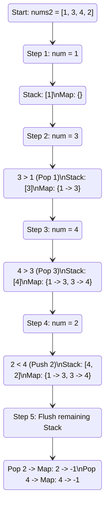

<h2><a href="https://leetcode.com/problems/next-greater-element-i">496. Next Greater Element I</a></h2>

<p>The <strong>next greater element</strong> of some element <code>x</code> in an array is the <strong>first greater</strong> element that is <strong>to the right</strong> of <code>x</code> in the same array.</p>

<p>You are given two <strong>distinct 0-indexed</strong> integer arrays <code>nums1</code> and <code>nums2</code>, where <code>nums1</code> is a subset of <code>nums2</code>.</p>

<p>For each <code>0 &lt;= i &lt; nums1.length</code>, find the index <code>j</code> such that <code>nums1[i] == nums2[j]</code> and determine the <strong>next greater element</strong> of <code>nums2[j]</code> in <code>nums2</code>. If there is no next greater element, then the answer for this query is <code>-1</code>.</p>

<p>Return <em>an array </em><code>ans</code><em> of length </em><code>nums1.length</code><em> such that </em><code>ans[i]</code><em> is the <strong>next greater element</strong> as described above.</em></p>

<p>&nbsp;</p>
<p><strong class="example">Example 1:</strong></p>

<pre><strong>Input:</strong> nums1 = [4,1,2], nums2 = [1,3,4,2]
<strong>Output:</strong> [-1,3,-1]
<strong>Explanation:</strong> The next greater element for each value of nums1 is as follows:
- 4 is underlined in nums2 = [1,3,<u>4</u>,2]. There is no next greater element, so the answer is -1.
- 1 is underlined in nums2 = [<u>1</u>,3,4,2]. The next greater element is 3.
- 2 is underlined in nums2 = [1,3,4,<u>2</u>]. There is no next greater element, so the answer is -1.
</pre>

<p><strong class="example">Example 2:</strong></p>

<pre><strong>Input:</strong> nums1 = [2,4], nums2 = [1,2,3,4]
<strong>Output:</strong> [3,-1]
<strong>Explanation:</strong> The next greater element for each value of nums1 is as follows:
- 2 is underlined in nums2 = [1,<u>2</u>,3,4]. The next greater element is 3.
- 4 is underlined in nums2 = [1,2,3,<u>4</u>]. There is no next greater element, so the answer is -1.
</pre>

<p>&nbsp;</p>
<p><strong>Constraints:</strong></p>

<ul>
	<li><code>1 &lt;= nums1.length &lt;= nums2.length &lt;= 1000</code></li>
	<li><code>0 &lt;= nums1[i], nums2[i] &lt;= 10<sup>4</sup></code></li>
	<li>All integers in <code>nums1</code> and <code>nums2</code> are <strong>unique</strong>.</li>
	<li>All the integers of <code>nums1</code> also appear in <code>nums2</code>.</li>
</ul>

<p>&nbsp;</p>
<strong>Follow up:</strong> Could you find an <code>O(nums1.length + nums2.length)</code> solution?

---

# 🛍️ Next-Greater-Element-I | Explained

## Approach 1: Monotonic Decreasing Stack with Hash Map Lookup
### Intuition
To find the "next greater element" for every number in an array efficiently, we can use a real-world analogy of a **line of people waiting to see over a wall**. 

Imagine elements of `nums2` standing in a line from left to right. When a new person (`num`) arrives who is taller than the people currently waiting in our tracking group (the stack), this new person becomes the "next greater element" for those shorter people. We record this height match in our registry (the hash map) and remove the shorter people from our active tracking group because their next greater element has been found. If the new person is shorter, they join the group and wait for someone taller to arrive later.

By keeping the stack in a **monotonically decreasing order** (from bottom to top), we guarantee that we can find the next greater element for any popped item in $O(1)$ time when a larger element is encountered.

### Algorithm Visualized
Below is a state-transition flowchart illustrating how the stack and the map evolve as we process `nums2 = [1, 3, 4, 2]`.



### Approach
1. **Initialize helper structures**:
   - A stack `st` to maintain a decreasing sequence of elements from `nums2`.
   - A hash map `map` to store the mapping of each element to its next greater element.
2. **Process `nums2`**:
   - For each `num` in `nums2`, check if it is greater than the top element of the stack.
   - If it is, the current `num` is the next greater element for `st.peek()`. Pop the top element and store the pair `(popped_element, num)` in the map. Repeat this check until the stack is empty or the top element is larger than `num`.
   - Push the current `num` onto the stack.
3. **Handle remaining elements**:
   - Any elements left in the stack after processing all elements of `nums2` have no greater element to their right. Pop them one by one and map them to `-1`.
4. **Query the results**:
   - Iterate through `nums1` and construct the output array using the pre-computed mappings from our map.

### Detailed Code Analysis

Let's break down the execution of your Java code block by block:

* **Lines 3–4**:
  ```java
  Stack <Integer> st = new Stack <>();
  HashMap <Integer, Integer> map = new HashMap<>();
  ```
  *Analysis:* You instantiate a standard standard library `Stack` and `HashMap`. 
  *Senior Engineer Note:* In modern Java production systems, `java.util.Stack` is considered a legacy class because it extends `Vector` and carries overhead due to internal synchronization (thread safety). A better performance choice would be a `Deque<Integer> st = new ArrayDeque<>();`.

* **Lines 6–11**:
  ```java
  for(int num: nums2){
      while(!st.isEmpty() && num>st.peek()){
          map.put(st.pop(),num);
      }
      st.push(num);
  }
  ```
  *Analysis:* This is the core Monotonic Stack algorithm. 
  - The `while` loop runs only when we find an element `num` that violates the decreasing property of the stack.
  - `st.pop()` retrieves and removes the top element. Since `num` is strictly greater than `st.peek()`, `num` is officially mapped as the next greater element for the popped value.
  - The current `num` is then pushed onto the stack to find its own next greater partner later.

* **Lines 13–15**:
  ```java
  while(!st.isEmpty()){
      map.put(st.pop(),-1);
  }
  ```
  *Analysis:* Here, you flush any elements that remained unmatched in the stack, mapping them explicitly to `-1`.
  *Senior Engineer Note:* This step is functionally correct but can be completely bypassed to optimize execution speed and save lines of code. During the retrieval loop, we can simply write `map.getOrDefault(nums1[i], -1)`. This avoids writing to the map for these values entirely.

* **Lines 17–21**:
  ```java
  int [] ans = new int[nums1.length];

  for(int i=0; i<ans.length; i++){
      ans[i] = map.get(nums1[i]);
  }
  ```
  *Analysis:* You declare an output array `ans` matching the length of `nums1`. For each element in `nums1`, you query your `map` in $O(1)$ constant time to fetch the pre-calculated next greater element.

### Code
Here is the clean implementation of your approach:

```java
import java.util.Stack;
import java.util.HashMap;

class Solution {
    public int[] nextGreaterElement(int[] nums1, int[] nums2) {
        Stack<Integer> st = new Stack<>();
        HashMap<Integer, Integer> map = new HashMap<>();

        // Process elements of nums2 to find next greater elements
        for (int num : nums2) {
            while (!st.isEmpty() && num > st.peek()) {
                map.put(st.pop(), num);
            }
            st.push(num);
        }

        // Elements left in stack have no next greater element
        while (!st.isEmpty()) {
            map.put(st.pop(), -1);
        }

        // Populate results for nums1
        int[] ans = new int[nums1.length];
        for (int i = 0; i < ans.length; i++) {
            ans[i] = map.get(nums1[i]);
        }

        return ans;
    }
}
```

### Complexity
- **Time Complexity:** $\mathcal{O}(N + M)$ 
  - Let $N$ be the length of `nums2` and $M$ be the length of `nums1`.
  - Even though there is a nested `while` loop inside the loop iterating over `nums2`, each element in `nums2` is pushed onto the stack exactly once and popped from the stack at most once. This results in amortized $\mathcal{O}(1)$ operations per element, leading to $\mathcal{O}(N)$ time for the first phase.
  - Building the answer array takes $\mathcal{O}(M)$ time, as hash map lookups take $\mathcal{O}(1)$ average time.
  - Overall Time Complexity: $\mathcal{O}(N + M)$.
- **Space Complexity:** $\mathcal{O}(N)$
  - In the worst-case scenario (e.g., `nums2` sorted in descending order), the stack will hold all $N$ elements of `nums2`, taking $\mathcal{O}(N)$ space.
  - The map will store entries for all $N$ elements of `nums2`, taking $\mathcal{O}(N)$ space.

---

## 🕵️‍♂️ Follow-up Questions

### 1. Why should you avoid `java.util.Stack` in a production environment, and what is the standard alternative?
**Answer:** 
`java.util.Stack` is a legacy class extending `java.util.Vector`. Every method in `Vector` (and subsequently `Stack`) is synchronized using object-level locks. This introduces unnecessary synchronization overhead in single-threaded environments. 

In modern Java, you should use the `Deque` interface:
```java
Deque<Integer> stack = new ArrayDeque<>();
```
`ArrayDeque` is not synchronized and is faster than `Stack` when used as a stack, and faster than `LinkedList` when used as a queue.

### 2. How would you handle duplicate values in `nums2` if the problem constraints were relaxed?
**Answer:**
If duplicate values were allowed in `nums2`, mapping by element value in a Hash Map would fail because duplicate keys would overwrite each other. To solve this:
1. Store **indices** on the stack instead of values.
2. The map would need to map the index of an element in `nums2` to its next greater element value (or index), rather than mapping the raw value.