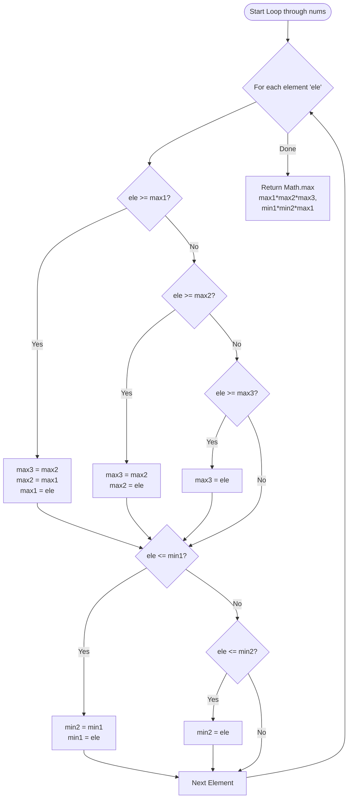

<h2><a href="https://leetcode.com/problems/maximum-product-of-three-numbers">628. Maximum Product of Three Numbers</a></h2>

<p>Given an integer array <code>nums</code>, <em>find three numbers whose product is maximum and return the maximum product</em>.</p>

<p>&nbsp;</p>
<p><strong class="example">Example 1:</strong></p>
<pre><strong>Input:</strong> nums = [1,2,3]
<strong>Output:</strong> 6
</pre><p><strong class="example">Example 2:</strong></p>
<pre><strong>Input:</strong> nums = [1,2,3,4]
<strong>Output:</strong> 24
</pre><p><strong class="example">Example 3:</strong></p>
<pre><strong>Input:</strong> nums = [-1,-2,-3]
<strong>Output:</strong> -6
</pre>
<p>&nbsp;</p>
<p><strong>Constraints:</strong></p>

<ul>
	<li><code>3 &lt;= nums.length &lt;=&nbsp;10<sup>4</sup></code></li>
	<li><code>-1000 &lt;= nums[i] &lt;= 1000</code></li>
</ul>


---

# 🛍️ Maximum-Product-of-Three-Numbers | Explained

## Approach 1: Single-Pass Linear Scan (Tracking 3 Maxima and 2 Minima)

### Intuition
To find the maximum product of three numbers in an array, we need to consider two distinct scenarios:
1. **Three largest positive numbers:** Multiplying the three largest positive numbers yields a large positive product.
2. **Two smallest (most negative) numbers and the largest positive number:** Multiplying two negative numbers yields a positive number. If their magnitude is large, multiplying them together along with the largest positive number can yield a product greater than the product of the three largest numbers.

Instead of sorting the entire array (which takes $O(N \log N)$ time), we can find these key elements in a single linear pass ($O(N)$ time) by continually updating variables tracking the three largest values (`max1`, `max2`, `max3`) and the two smallest values (`min1`, `min2`).

### Algorithm Visualized



### Approach
1. Initialize variables to track the three largest values (`max1`, `max2`, `max3`) and the two smallest values (`min1`, `min2`).
2. Iterate through each element `ele` in the input array `nums`.
3. For each element, check if it is larger than `max1`, `max2`, or `max3`, and ripple-shift the maximums accordingly to maintain top 3 descending values.
4. Concurrently, check if the element is smaller than `min1` or `min2`, and ripple-shift the minimums accordingly to maintain the bottom 2 ascending values.
5. After processing all elements, calculate the two candidate products:
   - Candidate A: `max1 * max2 * max3`
   - Candidate B: `min1 * min2 * max1`
6. Return the maximum of Candidate A and Candidate B.

### Detailed Code Analysis

#### Initializing Tracking Variables
```java
int max1 = -1000, max2 = -1000, max3 = -1000;
int min1 = 0, min2 = 0;
```
- The code initializes `max1`, `max2`, and `max3` to `-1000` based on problem constraints where array values satisfy $nums[i] \ge -1000$. (Note: Standard best practice in production or general competitive programming is to use `Integer.MIN_VALUE` and `Integer.MAX_VALUE` to avoid tight coupling to specific constraint boundaries).
- `min1` and `min2` are initialized to `0`.

#### Updating Maximum Values
```java
if(max1 <= ele){
    max3 = max2;
    max2 = max1;
    max1 = ele;
}
else if(max2 <= ele){
    max3 = max2;
    max2 = ele;
}
else if(max3 <= ele){
    max3 = ele;
}
```
- If `ele` is greater than or equal to `max1`, it becomes the new absolute maximum. The previous `max1` drops to `max2`, and the previous `max2` drops to `max3`.
- Otherwise, if `ele` is between `max1` and `max2`, `max2` is updated to `ele`, pushing the old `max2` to `max3`.
- Otherwise, if `ele` is between `max2` and `max3`, `max3` is directly updated to `ele`.

#### Updating Minimum Values
```java
if(min1 >= ele){
    min2 = min1;
    min1 = ele;
}
else if(min2 >= ele){
    min2 = ele;
}
```
- If `ele` is smaller than or equal to `min1`, it becomes the new absolute minimum. The previous `min1` drops to `min2`.
- Otherwise, if `ele` is between `min1` and `min2`, `min2` is updated to `ele`.

#### Calculating and Returning the Result
```java
return Math.max(
    max1 * max2 * max3,
    min1 * min2 * max1
);
```
- Evaluates both possible optimal product combinations and returns the larger product using `Math.max`.

### Code
```java
class Solution {
    public int maximumProduct(int[] nums) {
        int max1 = -1000, max2 = -1000, max3 = -1000;
        int min1 = 0, min2 = 0;

        for(int ele : nums){

            if(max1 <= ele){
                max3 = max2;
                max2 = max1;
                max1 = ele;
            }
            else if(max2 <= ele){
                max3 = max2;
                max2 = ele;
            }
            else if(max3 <= ele){
                max3 = ele;
            }

            if(min1 >= ele){
                min2 = min1;
                min1 = ele;
            }
            else if(min2 >= ele){
                min2 = ele;
            }
        }

        return Math.max(
            max1 * max2 * max3,
            min1 * min2 * max1
        );
    }
}
```

### Complexity
- **Time:** $\mathcal{O}(N)$ — We traverse the input array of size $N$ exactly once. Inside the loop, all conditional comparisons and updates execute in $\mathcal{O}(1)$ time.
- **Space:** $\mathcal{O}(1)$ — Only a constant number of primitive variables (`max1`, `max2`, `max3`, `min1`, `min2`) are used, requiring auxiliary memory independent of the input size.

## 🕵️‍♂️ Follow-up Questions (Optional)

### 1. How would you handle variable bounds cleanly without hardcoding `-1000` or `0`?
**Answer:** Use `Integer.MIN_VALUE` for the maximum trackers and `Integer.MAX_VALUE` for the minimum trackers. This ensures correctness regardless of problem constraint adjustments or negative inputs.

### 2. How can this pattern be generalized to find the maximum product of $K$ numbers?
**Answer:** For arbitrary $K$, maintaining individual variables becomes unwieldy. Instead, maintain two heaps or sorted sub-containers (a min-heap for the $K$ largest numbers and a max-heap for the $K$ smallest numbers). Alternatively, sorting the array gives an $\mathcal{O}(N \log N)$ baseline where we check products formed by combinations of $2m$ negative numbers and $K - 2m$ positive numbers.