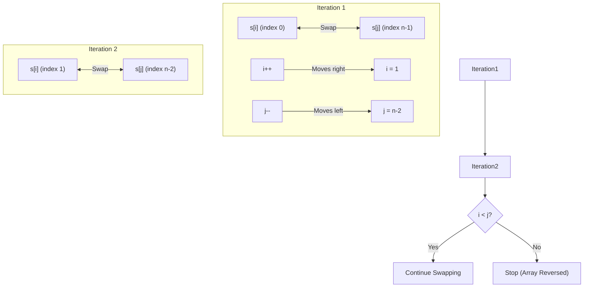
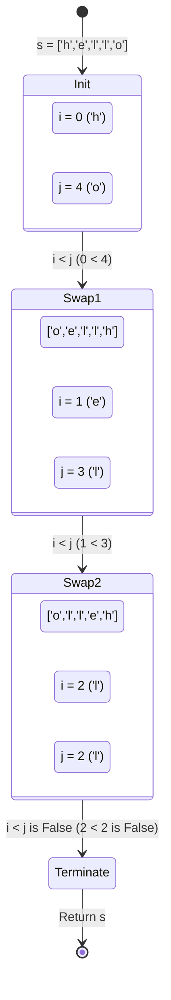

<h2><a href="https://leetcode.com/problems/reverse-string">344. Reverse String</a></h2>

<p>Write a function that reverses a string. The input string is given as an array of characters <code>s</code>.</p>

<p>You must do this by modifying the input array <a href="https://en.wikipedia.org/wiki/In-place_algorithm" target="_blank">in-place</a> with <code>O(1)</code> extra memory.</p>

<p>&nbsp;</p>
<p><strong class="example">Example 1:</strong></p>
<pre><strong>Input:</strong> s = ["h","e","l","l","o"]
<strong>Output:</strong> ["o","l","l","e","h"]
</pre><p><strong class="example">Example 2:</strong></p>
<pre><strong>Input:</strong> s = ["H","a","n","n","a","h"]
<strong>Output:</strong> ["h","a","n","n","a","H"]
</pre>
<p>&nbsp;</p>
<p><strong>Constraints:</strong></p>

<ul>
	<li><code>1 &lt;= s.length &lt;= 10<sup>5</sup></code></li>
	<li><code>s[i]</code> is a <a href="https://en.wikipedia.org/wiki/ASCII#Printable_characters" target="_blank">printable ascii character</a>.</li>
</ul>


---

# 🛍️ Reverse-String | Explained

## Approach 1: Classic Two-Pointer with `while` Loop

### Intuition
The core idea behind reversing an array in-place is the **Two-Pointer technique**. 

Imagine a row of playing cards laid out on a table. If you want to reverse their order, you don't need to pick them all up and re-arrange them from scratch. Instead, you can place your left hand on the first card and your right hand on the last card, and swap them. Then, you move your left hand one step to the right, your right hand one step to the left, and swap again. You repeat this process until your hands meet or cross in the middle. 

This approach works because it guarantees that every element is swapped with its symmetric counterpart on the opposite side of the array, completing the reversal with minimal overhead.

### Algorithm Visualized



### Approach
1. **Initialize pointers**: Create two pointers, `i` pointing to the start of the array (`0`) and `j` pointing to the end of the array (`s.length - 1`).
2. **Loop condition**: Execute a `while` loop that continues as long as `i` is strictly less than `j` (`i < j`). If `i == j` (for odd-length arrays), the middle element does not need to be swapped with itself. If `i > j` (for even-length arrays), the pointers have already crossed, and the array is fully reversed.
3. **Swap values**: 
   - Store the value of `s[i]` in a temporary variable `temp`.
   - Assign the value of `s[j]` to `s[i]`.
   - Assign the value of `temp` to `s[j]`.
4. **Update pointers**: Increment `i` by 1 to move rightward, and decrement `j` by 1 to move leftward.

### Detailed Code Analysis
In your commented-out code block, the execution flows as follows:

* **Lines 3-4**: `int i=0;` and `int j= s.length-1;` allocate two local local variables on the stack. This explicitly tracks our boundaries.
* **Line 5**: `while(i<j)` is our boundary guard. This prevents index out-of-bounds errors and unnecessary swaps when the pointers meet.
* **Lines 6-8**: 
  ```java
  char temp = s[i];
  s[i]= s[j];
  s[j]= temp;
  ```
  This is the classic three-step swap pattern. Because Java does not have built-in tuple unpacking or native swap operations for primitive arrays, a temporary variable `temp` of type `char` is allocated on the stack to prevent overwriting `s[i]` before its value can be copied to `s[j]`.
* **Lines 9-10**: `i++; j--;` update the state of the pointers, driving the system closer to the termination condition.

### Code
```java
class Solution {
    public void reverseString(char[] s) {
        int i = 0;
        int j = s.length - 1;
        while (i < j) {
            char temp = s[i];
            s[i] = s[j];
            s[j] = temp;
            i++;
            j--;
        }
    }
}
```

### Complexity
- **Time Complexity:** $\mathcal{O}(N)$, where $N$ is the length of the array $s$. The loop runs exactly $\lfloor N / 2 \rfloor$ times. Each iteration performs a constant number of operations (one comparison, one swap, two updates), making the time complexity linear.
- **Space Complexity:** $\mathcal{O}(1)$. The algorithm modifies the input array in-place, requiring only a constant amount of extra memory for the stack variables `i`, `j`, and `temp`.

---

## Approach 2: Idiomatic Two-Pointer with `for` Loop

### Intuition
This approach utilizes the exact same algorithmic intuition as Approach 1. However, it leverages the expressive nature of Java's `for` loop syntax to write cleaner, more idiomatic code. 

In a traditional `while` loop, initialization, condition checking, and state updates are scattered. A `for` loop consolidates these three concerns into a single line, making the code easier to read and reducing the scope of the iterator variables, which is a best practice in software engineering.

### Algorithm Visualized



### Approach
1. **Consolidated Loop Initialization**: Declare and initialize both `i` and `j` within the `for` loop initialization statement.
2. **Condition Assessment**: Maintain the termination condition `i < j`.
3. **Step Updates**: In the loop update expression, update both pointers simultaneously: `i++, j--`.
4. **Swap execution**: Inside the body of the loop, perform the character swap using a temporary variable `temp`.

### Detailed Code Analysis
Analyzing the active code you wrote:

* **Line 13**: `for (int i = 0, j = s.length - 1; i < j; i++, j--)`
  - *Initialization*: `int i = 0, j = s.length - 1` initializes both loop control variables. In Java, you can initialize multiple variables of the same type within a `for` loop initializer by separating them with commas.
  - *Scope*: This is highly idiomatic because the scope of `i` and `j` is strictly limited to the `for` loop block. Once the loop terminates, these variables are eligible for garbage collection/stack popping, preventing variable namespace pollution.
  - *Update*: `i++, j--` executes multiple expressions sequentially at the end of each iteration.
* **Lines 14-16**:
  ```java
  char temp = s[i];
  s[i] = s[j];
  s[j] = temp;
  ```
  This block handles the swap. A fresh `temp` variable is declared in each scope entry of the loop block. Modern Just-In-Time (JIT) compilers optimize this variable allocation, ensuring it does not degrade performance.
* **Line 18**: `return;`
  - While correct, this explicit `return;` statement in a `void` method is redundant in Java. The execution naturally reaches the closing bracket of the method and returns control to the caller. However, it does no harm.

### Code
```java
class Solution {
    public void reverseString(char[] s) {
        for (int i = 0, j = s.length - 1; i < j; i++, j--) {
            char temp = s[i];
            s[i] = s[j];
            s[j] = temp;
        }
    }
}
```

### Complexity
- **Time Complexity:** $\mathcal{O}(N)$ where $N$ is the length of array $s$. The array is traversed halfway from both ends.
- **Space Complexity:** $\mathcal{O}(1)$ auxiliary space. The swap requires a single primitive `char` variable, satisfying the strict $O(1)$ extra memory constraint of the problem.

---

## 🕵️‍♂️ Follow-up Questions

### 1. Why does LeetCode use a `char[]` instead of a `String` for this problem in Java?
In Java, `String` objects are immutable. Any operation that appears to modify a `String` (like reversing it) actually creates a brand-new `String` object in memory. This would require $\mathcal{O}(N)$ auxiliary space, violating the in-place modification requirement. By passing a mutable character array (`char[]`), the caller allows the function to modify the array's contents directly in-place with $\mathcal{O}(1)$ auxiliary space.

### 2. Can this problem be solved recursively, and what are the trade-offs?
Yes, it can be solved recursively by passing the array and the boundaries to a helper function:
```java
public void reverseHelper(char[] s, int i, int j) {
    if (i >= j) return;
    char temp = s[i];
    s[i] = s[j];
    s[j] = temp;
    reverseHelper(s, i + 1, j - 1);
}
```
**Trade-offs:** 
While the recursive approach is elegant and uses no explicit loop structures, its **Space Complexity is $\mathcal{O}(N)$** due to the call stack depth (each recursive call adds a stack frame). For a very large array, this can trigger a `StackOverflowError`. Thus, the iterative two-pointer approaches you wrote are vastly superior for production environments.