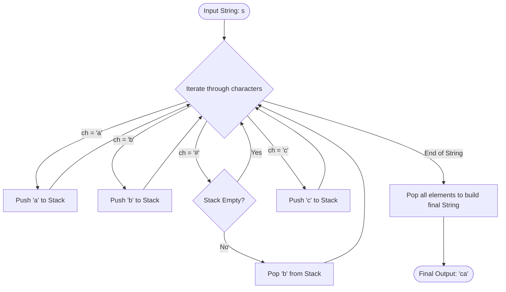

<h2><a href="https://leetcode.com/problems/backspace-string-compare">844. Backspace String Compare</a></h2>

<p>Given two strings <code>s</code> and <code>t</code>, return <code>true</code> <em>if they are equal when both are typed into empty text editors</em>. <code>'#'</code> means a backspace character.</p>

<p>Note that after backspacing an empty text, the text will continue empty.</p>

<p>&nbsp;</p>
<p><strong class="example">Example 1:</strong></p>

<pre><strong>Input:</strong> s = "ab#c", t = "ad#c"
<strong>Output:</strong> true
<strong>Explanation:</strong> Both s and t become "ac".
</pre>

<p><strong class="example">Example 2:</strong></p>

<pre><strong>Input:</strong> s = "ab##", t = "c#d#"
<strong>Output:</strong> true
<strong>Explanation:</strong> Both s and t become "".
</pre>

<p><strong class="example">Example 3:</strong></p>

<pre><strong>Input:</strong> s = "a#c", t = "b"
<strong>Output:</strong> false
<strong>Explanation:</strong> s becomes "c" while t becomes "b".
</pre>

<p>&nbsp;</p>
<p><strong>Constraints:</strong></p>

<ul>
	<li><code><span>1 &lt;= s.length, t.length &lt;= 200</span></code></li>
	<li><span><code>s</code> and <code>t</code> only contain lowercase letters and <code>'#'</code> characters.</span></li>
</ul>

<p>&nbsp;</p>
<p><strong>Follow up:</strong> Can you solve it in <code>O(n)</code> time and <code>O(1)</code> space?</p>


---

# 🛍️ Backspace-String-Compare | Explained

## Approach 1: Stack-Based Simulation with String Reconstruction
### Intuition
Think of typing on a keyboard with a text buffer. When you type a normal character, it is appended to the end of the text. When you press the backspace key (`#`), it erases the most recently typed character. 

This behavior mirrors a **Last-In, First-Out (LIFO)** data structure. The most recently typed character is at the top of our "history" stack. When we encounter a `#`, we simply discard (or `pop`) the character at the top of the stack. If there are no characters left in our history (the stack is empty), a backspace does nothing.

By simulating this process for both strings using stacks, we can reconstruct the final typed strings and compare them.

### Algorithm Visualized
Below is the processing flow for a string (e.g., `s = "ab#c"`) through the stack simulation:



### Approach
1. **Initialize Stacks**: Create two stacks, `st` and `tt`, to keep track of the valid characters for strings `s` and `t` respectively.
2. **Process First String (`s`)**:
   - Loop through each character of `s`.
   - If the character is `#`, check if the stack `st` is non-empty. If so, pop the top element.
   - If the character is not `#`, push it onto stack `st`.
3. **Reconstruct Resulting String (`s1`)**:
   - Pop all elements from stack `st` and append them to a string `s1`. Note that this will yield the string in reverse order, which is fine as long as we treat both strings identically.
4. **Process Second String (`t`)**:
   - Repeat the exact same loop logic for string `t` using stack `tt`.
5. **Reconstruct Resulting String (`s2`)**:
   - Pop all elements from stack `tt` and append them to string `s2`.
6. **Comparison**: Compare `s1` and `s2`. If they are equal, return `true`; otherwise, return `false`.

---

### Detailed Code Analysis

Let's dissect the code line-by-line and identify critical implementation choices and syntax bugs.

#### 1. Stack Declarations (Lines 3-4)
```java
Stack <Character> st = new Stack<>();
Stack <Character> tt = new Stack<>();
```
* **Analysis**: The solution uses Java's legacy `java.util.Stack` class. 
* **Senior Engineer Note**: In modern Java, it is highly recommended to use `Deque<Character> stack = new ArrayDeque<>()` instead of `Stack`. `java.util.Stack` is synchronized, which introduces unnecessary overhead in single-threaded environments.

#### 2. Processing String `s` (Lines 9-20)
```java
for(int i=0; i<n1; i++){
    char ch = s.charAt(i);

    if(ch == '#'){
        if(!st.isEmpty()){
            st.pop();
        }
    }
    else{
        st.push(ch);
    }
}
```
* **Analysis**: This block correctly implements the backspace logic. The guard clause `if(!st.isEmpty())` prevents a `EmptyStackException` when encountering consecutive or leading `#` backspaces (e.g., `s = "###a"`).

#### 3. **Critical Compilation Error** & Inefficiency (Lines 22-25)
```java
String s1 = ;
while(!st.isEmpty()){
    s1 += st.pop();
}
```
* **Analysis**: 
  - **Syntax Error**: Line 22 is incomplete and will fail compilation: `String s1 = ;`. It must be initialized as `String s1 = "";`.
  - **Performance Bottleneck**: Concatenating strings in a loop (`s1 += st.pop();`) is highly inefficient in Java. Strings are immutable; each iteration creates a new `StringBuilder` object under the hood, leading to $O(K^2)$ time complexity for reconstruction, where $K$ is the size of the stack. A `StringBuilder` should be used instead.

#### 4. Processing and Reconstructing String `t` (Lines 28-44)
```java
String s2 = ;
while(!tt.isEmpty()){
    s2 += tt.pop();
}
```
* **Analysis**: 
  - **Syntax Error**: Line 41 suffers from the same initialization error: `String s2 = ;`.
  - Same performance penalty as above due to iterative string concatenation.

#### 5. Comparison (Lines 46-47)
```java
if(s1.equals(s2)) return true;
else return false;
```
* **Analysis**: This comparison is correct because the reversed characters from both stacks will still align if the original reconstructed strings were equivalent.
* **Refactoring Note**: This verbose `if-else` block can be simplified directly to:
  ```java
  return s1.equals(s2);
  ```

---

### Corrected Code
Here is the clean, compilable, and optimized version of your exact approach using `StringBuilder` to fix the compilation and performance bottlenecks:

```java
import java.util.Stack;

class Solution {
    public boolean backspaceCompare(String s, String t) {
        Stack<Character> st = new Stack<>();
        Stack<Character> tt = new Stack<>();

        int n1 = s.length();
        int n2 = t.length();

        // Process first string
        for (int i = 0; i < n1; i++) {
            char ch = s.charAt(i);
            if (ch == '#') {
                if (!st.isEmpty()) {
                    st.pop();
                }
            } else {
                st.push(ch);
            }
        }

        // Reconstruct s1 efficiently using StringBuilder
        StringBuilder s1 = new StringBuilder();
        while (!st.isEmpty()) {
            s1.append(st.pop());
        }

        // Process second string
        for (int i = 0; i < n2; i++) {
            char ch = t.charAt(i);
            if (ch == '#') {
                if (!tt.isEmpty()) {
                    tt.pop();
                }
            } else {
                tt.push(ch);
            }
        }

        // Reconstruct s2 efficiently using StringBuilder
        StringBuilder s2 = new StringBuilder();
        while (!tt.isEmpty()) {
            s2.append(tt.pop());
        }

        return s1.toString().equals(s2.toString());
    }
}
```

---

### Complexity
- **Time Complexity:** 
  - **With the bug-fixed code (using `StringBuilder`):** $O(N + M)$ where $N$ is the length of string `s` and `M` is the length of string `t`. We loop through each string exactly once to build the stacks, and then loop through the stacks once to build the string representations.
  - **With your original code (using String concatenation):** $O(N^2 + M^2)$ in the worst-case (no backspaces) due to the overhead of recreating string objects on every character concatenation.
- **Space Complexity:** $O(N + M)$ auxiliary space. In the worst-case scenario (no backspace characters), both stacks and reconstructed strings will store all characters of `s` and `t`.

---

## 🕵️‍♂️ Follow-up Questions

### 1. Can we solve this problem in $O(1)$ space?
**Answer:** 
Yes. The $O(1)$ space complexity constraint is a classic follow-up interview question. Instead of simulating the process from left-to-right (which forces us to store characters because we don't know if they will be deleted by future backspaces), we can traverse **from right-to-left**.

By going backwards, we know immediately how many backspaces are pending. We can maintain a skip counter. If we see a `#`, we increment the skip counter. If we see a normal character and the skip counter is greater than `0`, we skip that character and decrement the counter.

### 2. How does the Two-Pointer approach work in $O(1)$ space?
Here is the brief implementation of that optimal approach:

```java
class Solution {
    public boolean backspaceCompare(String s, String t) {
        int i = s.length() - 1;
        int j = t.length() - 1;
        int skipS = 0, skipT = 0;

        while (i >= 0 || j >= 0) {
            // Find next valid character in s
            while (i >= 0) {
                if (s.charAt(i) == '#') { skipS++; i--; }
                else if (skipS > 0) { skipS--; i--; }
                else break;
            }
            // Find next valid character in t
            while (j >= 0) {
                if (t.charAt(j) == '#') { skipT++; j--; }
                else if (skipT > 0) { skipT--; j--; }
                else break;
            }

            // Compare the valid characters
            if (i >= 0 && j >= 0 && s.charAt(i) != t.charAt(j)) {
                return false;
            }
            // If one string runs out of characters and the other doesn't
            if ((i >= 0) != (j >= 0)) {
                return false;
            }
            i--; j--;
        }
        return true;
    }
}
```
- **Time Complexity:** $O(N + M)$
- **Space Complexity:** $O(1)$ auxiliary space.