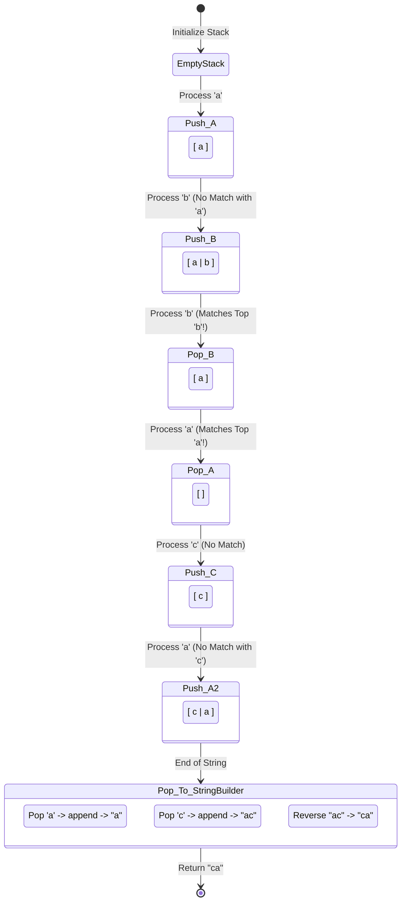

<h2><a href="https://leetcode.com/problems/remove-all-adjacent-duplicates-in-string">1047. Remove All Adjacent Duplicates In String</a></h2>

<p>You are given a string <code>s</code> consisting of lowercase English letters. A <strong>duplicate removal</strong> consists of choosing two <strong>adjacent</strong> and <strong>equal</strong> letters and removing them.</p>

<p>We repeatedly make <strong>duplicate removals</strong> on <code>s</code> until we no longer can.</p>

<p>Return <em>the final string after all such duplicate removals have been made</em>. It can be proven that the answer is <strong>unique</strong>.</p>

<p>&nbsp;</p>
<p><strong class="example">Example 1:</strong></p>

<pre><strong>Input:</strong> s = "abbaca"
<strong>Output:</strong> "ca"
<strong>Explanation:</strong> 
For example, in "abbaca" we could remove "bb" since the letters are adjacent and equal, and this is the only possible move.  The result of this move is that the string is "aaca", of which only "aa" is possible, so the final string is "ca".
</pre>

<p><strong class="example">Example 2:</strong></p>

<pre><strong>Input:</strong> s = "azxxzy"
<strong>Output:</strong> "ay"
</pre>

<p>&nbsp;</p>
<p><strong>Constraints:</strong></p>

<ul>
	<li><code>1 &lt;= s.length &lt;= 10<sup>5</sup></code></li>
	<li><code>s</code> consists of lowercase English letters.</li>
</ul>


---

# 🛍️ Remove-All-Adjacent-Duplicates-In-String | Explained

## Approach 1: Stack with Optimized StringBuilder Reconstruction (Active Code)

### Intuition
The problem requires us to repeatedly remove adjacent duplicate characters. This behavior behaves exactly like a **Last-In, First-Out (LIFO)** data structure. 

Imagine processing the string character by character. When we look at a character, we want to know: *Does this match the immediate neighbor we finalized just before this?* 
By using a stack:
1. We push characters onto the stack as we scan the string.
2. If the current character matches the character at the top of the stack, we have found an adjacent duplicate pair. We "annihilate" them by popping the character off the stack.
3. If it does not match, we push it onto the stack, as it is currently part of our unique, processed prefix.

Once the entire string is processed, the stack contains the unique characters in order. However, since a stack pops elements in reverse order, we retrieve them, append them to a mutable `StringBuilder`, and reverse the final sequence to restore the original left-to-right order.

### Algorithm Visualized
For an input string `s = "abbaca"`:



### Approach
1. **Initialize** a stack of characters `st` to keep track of processed characters.
2. **Iterate** through each character of the string `s` from index `0` to `n - 1`.
3. For each character `current`:
   - Check if the stack is empty.
   - If the stack is empty **or** the top element (`st.peek()`) does not equal `current`, push `current` onto the stack.
   - If the top element matches `current`, pop the top element from the stack (eliminating the adjacent duplicate).
4. **Reconstruct** the final string:
   - Instantiate a `StringBuilder`.
   - Read the size of the stack `si`.
   - Loop `si` times, popping characters from the stack and appending them to the `StringBuilder`.
5. **Reverse** the `StringBuilder` to correct the LIFO order reversal, and return it as a string.

### Detailed Code Analysis
- **Lines 3-5**: 
  ```java
  int n = s.length();
  Stack<Character> st = new Stack<>();
  ```
  We cache the length of the string to avoid repeatedly calling `s.length()` in the loop control. We instantiate `java.util.Stack`. Note that `java.util.Stack` is a legacy synchronized class, which adds unnecessary synchronization overhead, but it perfectly models the LIFO logic.

- **Lines 7-13**:
  ```java
  for(int i=0; i<n; i++){
      char current = s.charAt(i);
      if(st.isEmpty()||st.peek()!=current)st.push(current);
      else{
          st.pop();
      }
  }
  ```
  We run a single-pass loop over the string. We check if `st.isEmpty()` first to prevent a `EmptyStackException` when calling `st.peek()`. Short-circuit evaluation (`||`) ensures that `st.peek()` is only called if the stack is not empty. If there's a match, `st.pop()` discards the duplicate.

- **Lines 16-21**:
  ```java
  StringBuilder  ans = new StringBuilder ();
  int si = st.size();
  for(int i=0; i<si; i++){
      ans.append(st.pop());
  }
  ```
  We initialize a `StringBuilder` which acts as a mutable, dynamically-resizable char array. We cache `st.size()` in `si` because the stack's size decreases on every iteration inside the loop as we pop elements. Using `i < st.size()` directly in the loop condition would cause the loop to terminate prematurely (after processing only half the elements).

- **Line 23**:
  ```java
  return ans.reverse().toString();
  ```
  Since elements were popped off the stack in reverse-chronological order, the string inside `StringBuilder` is reversed. We call `.reverse()` which swaps the characters in-place in $O(N)$ time, then convert it to an immutable `String`.

### Code
```java
class Solution {
    public String removeDuplicates(String s) {
        int n = s.length();

        Stack<Character> st = new Stack<>();

        for(int i=0; i<n; i++){
            char current = s.charAt(i);
            if(st.isEmpty() || st.peek() != current) {
                st.push(current);
            } else {
                st.pop();
            }
        }

        StringBuilder ans = new StringBuilder();
        int si = st.size();
        for(int i=0; i<si; i++){
            ans.append(st.pop());
        }

        return ans.reverse().toString();
    }
}
```

### Complexity
- **Time Complexity:** $\mathcal{O}(N)$  
  We perform a single pass over the input string of length $N$. Each character is pushed to and popped from the stack at most once. Reversing the `StringBuilder` takes linear time proportional to the number of remaining characters (at most $N$). Thus, the overall run time is linear.
- **Space Complexity:** $\mathcal{O}(N)$  
  In the worst-case scenario (e.g., if there are no duplicate characters in the string like `"abcdef"`), the stack will store all $N$ characters. The `StringBuilder` also holds up to $N$ characters.

---

## Approach 2: Stack with Naive String Concatenation (Commented-out Draft Variant)

### Intuition
This approach utilizes the exact same stack-based deduplication logic as Approach 1. However, it differs significantly in its **string reconstruction phase**. 

In the commented-out lines `//String ans=;` and `//ans += st.pop();`, the solution attempts to reconstruct the final string using standard String concatenation (`+`) inside a loop instead of using a `StringBuilder`. 

While functionally correct, this is an anti-pattern in Java. Because `java.lang.String` objects are immutable, every time we write `ans += st.pop()`, the JVM must allocate a completely new String object, copying over all existing characters from `ans` and appending the popped character. This degrades performance drastically.

### Approach
1. **Deduplicate** characters using a `Stack<Character>` through a single pass over the input string.
2. **Reconstruct** the output by initializing an empty String `ans = ""`.
3. Loop through the stack, popping each element and appending it directly to `ans` via `ans += st.pop()`.
4. Create a temporary `StringBuilder` or manual reversal mechanism to reverse the concatenated string and return it.

### Detailed Code Analysis
- **Line 14**:
  ```java
  //String ans=;
  ```
  This is a draft declaration of an immutable `String` variable intended to accumulate the characters popped from the stack.
- **Line 19**:
  ```java
  //ans += st.pop();
  ```
  Behind the scenes, the Java compiler translates `ans += st.pop()` to something resembling:
  `ans = new StringBuilder().append(ans).append(st.pop()).toString();`
  This means that for every single character popped from the stack, a new `StringBuilder` is allocated, the contents of `ans` are copied into it, the character is appended, and a new `String` is allocated. If the stack has $K$ elements, this copies $1 + 2 + 3 + ... + K$ characters, resulting in quadratic overhead.

### Code
```java
class Solution {
    public String removeDuplicates(String s) {
        int n = s.length();

        Stack<Character> st = new Stack<>();

        for(int i=0; i<n; i++){
            char current = s.charAt(i);
            if(st.isEmpty() || st.peek() != current) {
                st.push(current);
            } else {
                st.pop();
            }
        }

        String ans = "";
        int si = st.size();
        for(int i=0; i<si; i++){
            ans += st.pop(); // Warning: O(N^2) time complexity bottleneck
        }

        return new StringBuilder(ans).reverse().toString();
    }
}
```

### Complexity
- **Time Complexity:** $\mathcal{O}(N^2)$  
  The deduplication loop still runs in $\mathcal{O}(N)$ time. However, the string reconstruction loop runs $K$ times (where $K \le N$). In each of these $K$ iterations, appending a character to an immutable string takes $\mathcal{O}(\text{length of } ans)$ operations. This yields a summation of $1 + 2 + \dots + K \approx \frac{K^2}{2}$ operations. In the worst case, this degrades the time complexity to $\mathcal{O}(N^2)$, which will trigger a Time Limit Exceeded (TLE) error on LeetCode for large inputs.
- **Space Complexity:** $\mathcal{O}(N)$  
  The auxiliary space for the stack is still $\mathcal{O}(N)$. However, this approach causes massive heap churn and garbage collection pressure due to the continuous allocation of short-lived intermediate string objects.

---

## 🕵️‍♂️ Follow-up Questions

### 1. Can we optimize this solution to use $\mathcal{O}(1)$ auxiliary space?
Yes. Instead of using an external object-based `Stack<Character>`, we can simulate a stack inside a mutable character array (or a `StringBuilder` itself acting as a stack pointer). 

Using a two-pointer approach or an in-place modification on a character array:
```java
public String removeDuplicates(String s) {
    char[] res = s.toCharArray();
    int i = 0; // 'i' acts as the stack pointer (size of the stack)
    for (int j = 0; j < s.length(); j++) {
        res[i] = res[j];
        if (i > 0 && res[i] == res[i - 1]) {
            i -= 2; // Match found: pop both elements by moving the pointer back
        }
        i++;
    }
    return new String(res, 0, i);
}
```
* **Time Complexity:** $\mathcal{O}(N)$
* **Space Complexity:** $\mathcal{O}(1)$ auxiliary space if we modify the character array converted from the input.

### 2. Why is `java.util.Stack` generally discouraged in modern Java codebases?
`java.util.Stack` extends `java.util.Vector`, which is a legacy class designed in Java 1.0. All of its operations are synchronized (thread-safe) using internal locks. In a single-threaded environment (like typical algorithmic competitive programming or most web requests), acquiring and releasing these locks incurs a performance penalty.

A better modern alternative is to use `java.util.Deque` implemented via `java.util.ArrayDeque`:
```java
Deque<Character> stack = new ArrayDeque<>();
```
Or, even better for this specific problem, use a `StringBuilder` directly as a stack to completely avoid any stack-to-string conversion or reversal:
```java
StringBuilder sb = new StringBuilder();
for (char c : s.toCharArray()) {
    int len = sb.length();
    if (len > 0 && sb.charAt(len - 1) == c) {
        sb.deleteCharAt(len - 1); // pop
    } else {
        sb.append(c); // push
    }
}
return sb.toString();
```