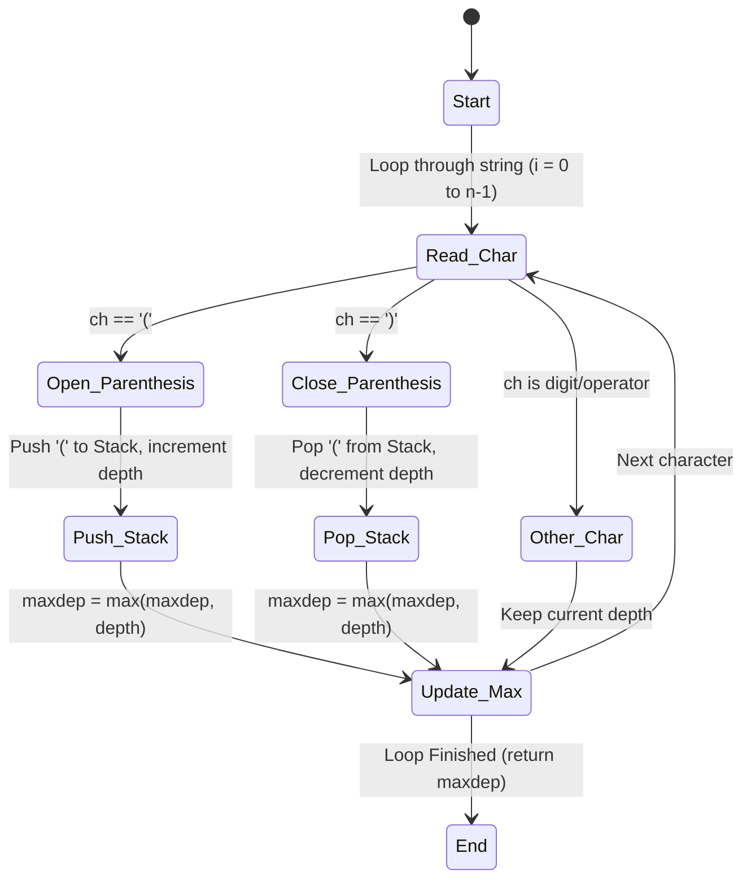

<h2><a href="https://leetcode.com/problems/maximum-nesting-depth-of-the-parentheses">1614. Maximum Nesting Depth of the Parentheses</a></h2>

<p>Given a <strong>valid parentheses string</strong> <code>s</code>, return the <strong>nesting depth</strong> of<em> </em><code>s</code>. The nesting depth is the <strong>maximum</strong> number of nested parentheses.</p>

<p>&nbsp;</p>
<p><strong class="example">Example 1:</strong></p>

<div class="example-block">
<p><strong>Input:</strong> <span class="example-io">s = "(1+(2*3)+((8)/4))+1"</span></p>

<p><strong>Output:</strong> <span class="example-io">3</span></p>

<p><strong>Explanation:</strong></p>

<p>Digit 8 is inside of 3 nested parentheses in the string.</p>
</div>

<p><strong class="example">Example 2:</strong></p>

<div class="example-block">
<p><strong>Input:</strong> <span class="example-io">s = "(1)+((2))+(((3)))"</span></p>

<p><strong>Output:</strong> <span class="example-io">3</span></p>

<p><strong>Explanation:</strong></p>

<p>Digit 3 is inside of 3 nested parentheses in the string.</p>
</div>

<p><strong class="example">Example 3:</strong></p>

<div class="example-block">
<p><strong>Input:</strong> <span class="example-io">s = "()(())((()()))"</span></p>

<p><strong>Output:</strong> <span class="example-io">3</span></p>
</div>

<p>&nbsp;</p>
<p><strong>Constraints:</strong></p>

<ul>
	<li><code>1 &lt;= s.length &lt;= 100</code></li>
	<li><code>s</code> consists of digits <code>0-9</code> and characters <code>'+'</code>, <code>'-'</code>, <code>'*'</code>, <code>'/'</code>, <code>'('</code>, and <code>')'</code>.</li>
	<li>It is guaranteed that parentheses expression <code>s</code> is a VPS.</li>
</ul>


---

# 🛍️ Maximum-Nesting-Depth-of-the-Parentheses | Explained

## Approach 1: Stack-Based Depth Tracking
### Intuition
Think of finding the maximum nesting depth of parentheses like entering and leaving tunnels. Every time you encounter an opening parenthesis `(`, you are entering a level deeper into a nested tunnel. Every time you encounter a closing parenthesis `)`, you are exiting a tunnel level and returning to the previous level. 

To keep track of how deep we are at any given point, we can use a Stack to store the open parentheses we have encountered but not yet closed. The size of the stack (or a simple counter incremented alongside stack operations) represents our current depth. By tracking the maximum size the stack reaches during the entire traversal, we find the maximum nesting depth of the string.

### Algorithm Visualized


### Approach
1. **Initialize helper variables:** Create an empty stack `st` of characters to keep track of the open parentheses. Initialize `depth` to track the current nesting depth and `maxdep` to track the maximum depth encountered so far.
2. **Iterate through the string:** Loop through the input string `s` character by character.
3. **Handle Open Parenthesis `(`:** When a `(` is encountered, push it onto the stack to represent entering a deeper nested level, and increment the `depth` counter.
4. **Handle Close Parenthesis `)`:** When a `)` is encountered, pop the corresponding open parenthesis from the stack and decrement the `depth` counter.
5. **Update maximum depth:** At each iteration, update `maxdep` to be the maximum of its current value and the newly calculated `depth`.
6. **Return result:** Once the loop completes, return `maxdep`.

### Detailed Code Analysis
- **Lines 3-4:** 
  ```java
  Stack <Character> st = new Stack<>();
  int n= s.length();
  ```
  We initialize a `java.util.Stack` named `st` to hold character objects. We also store the length of the string in variable `n` to avoid repeatedly querying `s.length()` during the loop boundaries, which is a minor optimization.
- **Lines 6-7:**
  ```java
  int depth = 0;
  int maxdep = 0;
  ```
  `depth` acts as our active tracker of how many unmatched open parentheses we have currently encountered. `maxdep` caches the highest level of nesting seen at any point during iteration.
- **Lines 8-9:**
  ```java
  for(int i=0; i<n; i++){
      char ch = s.charAt(i);
  ```
  We begin a standard sequential scan of the string. `s.charAt(i)` retrieves the character at index `i`.
- **Lines 10-13:**
  ```java
  if(ch == '('){
      st.push(ch);
      depth++;
  } 
  ```
  When we see an open parenthesis, we push it to the stack `st` and increment `depth`. This represents diving one level deeper.
- **Lines 14-17:**
  ```java
  else if(ch == ')'){
      st.pop();
      depth-- ;
  }
  ```
  When we encounter a closing parenthesis, we assume the string is valid (as per the problem statement constraints). We pop the matching open parenthesis from our stack and decrement our `depth` counter to signify that we have exited one level of nesting.
- **Lines 18-20:**
  ```java
  maxdep = Math.max(maxdep, depth);
  }
  return maxdep;
  ```
  After processing the current character, we update `maxdep` with the maximum of its current value and the current `depth`. Placing this outside the conditional blocks ensures that `maxdep` is safely maintained throughout the entire loop. Finally, we return `maxdep`.

### Code
```java
class Solution {
    public int maxDepth(String s) {
        Stack <Character> st = new Stack<>();
        int n= s.length();

        int depth = 0;
        int maxdep = 0;
        for(int i=0; i<n; i++){
            char ch = s.charAt(i);
            if(ch == '('){
                st.push(ch);
                depth++;
            } 
            else if(ch == ')'){
                st.pop();
                depth-- ;
            }
            maxdep = Math.max(maxdep, depth);
        }
        return maxdep;
    }
}
```

### Complexity
- **Time:** $\mathcal{O}(N)$, where $N$ is the length of the string `s`. We iterate through the string of length $N$ exactly once. Each character look-up, stack push, and stack pop takes constant time $\mathcal{O}(1)$.
- **Space:** $\mathcal{O}(N)$ auxiliary space. In the worst-case scenario (e.g., a string of nested parentheses like `(((())))`), we will push up to $N/2$ characters onto the stack, resulting in linear space complexity proportional to the input size.

---

## 🕵️‍♂️ Follow-up Questions

### 1. Can we optimize this solution to use $\mathcal{O}(1)$ auxiliary space?
**Yes.** The stack `st` is technically redundant. Since we are only pushing a uniform character `'('` and popping it, the stack's size is always perfectly synchronized with the integer variable `depth`. 

By removing the `Stack<Character>` entirely and relying purely on the integer variable `depth` to increment on `(` and decrement on `)`, we reduce the auxiliary space complexity from $\mathcal{O}(N)$ to $\mathcal{O}(1)$ while keeping the time complexity at $\mathcal{O}(N)$.

### 2. How does the code handle invalid parentheses inputs (e.g., mismatch or unmatched closing brackets)?
The problem statement guarantees that the input string `s` is a VPS (Valid Parentheses String). However, if this constraint were relaxed:
- If there are extra closing brackets (e.g., `())`), calling `st.pop()` on an empty stack would throw an `EmptyStackException`.
- To make this code production-ready for invalid inputs, we should add a safety check: `if (!st.isEmpty() && ch == ')')`.