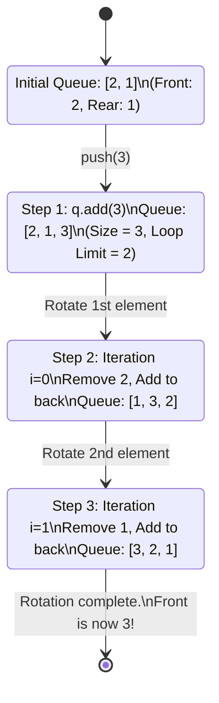

<h2><a href="https://leetcode.com/problems/implement-stack-using-queues">225. Implement Stack using Queues</a></h2>

<p>Implement a last-in-first-out (LIFO) stack using only two queues. The implemented stack should support all the functions of a normal stack (<code>push</code>, <code>top</code>, <code>pop</code>, and <code>empty</code>).</p>

<p>Implement the <code>MyStack</code> class:</p>

<ul>
	<li><code>void push(int x)</code> Pushes element x to the top of the stack.</li>
	<li><code>int pop()</code> Removes the element on the top of the stack and returns it.</li>
	<li><code>int top()</code> Returns the element on the top of the stack.</li>
	<li><code>boolean empty()</code> Returns <code>true</code> if the stack is empty, <code>false</code> otherwise.</li>
</ul>

<p><b>Notes:</b></p>

<ul>
	<li>You must use <strong>only</strong> standard operations of a queue, which means that only <code>push to back</code>, <code>peek/pop from front</code>, <code>size</code> and <code>is empty</code> operations are valid.</li>
	<li>Depending on your language, the queue may not be supported natively. You may simulate a queue using a list or deque (double-ended queue) as long as you use only a queue's standard operations.</li>
</ul>

<p>&nbsp;</p>
<p><strong class="example">Example 1:</strong></p>

<pre><strong>Input</strong>
["MyStack", "push", "push", "top", "pop", "empty"]
[[], [1], [2], [], [], []]
<strong>Output</strong>
[null, null, null, 2, 2, false]

<strong>Explanation</strong>
MyStack myStack = new MyStack();
myStack.push(1);
myStack.push(2);
myStack.top(); // return 2
myStack.pop(); // return 2
myStack.empty(); // return False
</pre>

<p>&nbsp;</p>
<p><strong>Constraints:</strong></p>

<ul>
	<li><code>1 &lt;= x &lt;= 9</code></li>
	<li>At most <code>100</code> calls will be made to <code>push</code>, <code>pop</code>, <code>top</code>, and <code>empty</code>.</li>
	<li>All the calls to <code>pop</code> and <code>top</code> are valid.</li>
</ul>

<p>&nbsp;</p>
<p><strong>Follow-up:</strong> Can you implement the stack using only one queue?</p>


---

# 🛍️ Implement-Stack-using-Queues | Explained

## Approach 1: Single Queue with Push-Rotation Optimization
### Intuition
The fundamental difference between a Stack (Last-In-First-Out, LIFO) and a Queue (First-In-First-Out, FIFO) lies in the access point. A stack processes the most recently added element, while a queue processes the oldest. 

To implement a stack using a single queue, we must manipulate the queue so that the newly added element—which naturally goes to the back of the queue—is positioned at the very front (the head). 

Think of this like a circular queue rotation or a card-shuffling trick:
1. We place the new card at the bottom of the deck (the rear of the queue).
2. We then take cards from the top of the deck (the front of the queue) one by one and place them at the bottom.
3. We repeat this rotation exactly $N-1$ times (where $N$ is the current size of the queue).
4. As a result, the newly added card is left sitting at the very top of the deck (the front of the queue), ready to be accessed first.

### Algorithm Visualized

Below is a state-transition diagram demonstrating how the queue is mutated during `push(3)` when the queue already contains `[2, 1]` (where `2` is at the front).



### Approach
1. **Initialization**: We instantiate a single standard FIFO queue interface (`java.util.Queue`) backed by a double-linked list (`java.util.LinkedList`).
2. **Push Operation (`push(int x)`)**:
    * Insert the element $x$ into the rear of the queue.
    * Capture the current size of the queue.
    * Iterate exactly `size - 1` times. In each iteration, dequeue (`remove()`) the element from the front and immediately enqueue (`add()`) it back into the rear.
    * This rotates all previously added elements behind the newly inserted element $x$.
3. **Pop Operation (`pop()`)**:
    * Since the most recently pushed element is kept at the front of the queue, we simply dequeue it using `q.remove()`.
4. **Top Operation (`top()`)**:
    * Retrieve, but do not remove, the front element of the queue using `q.peek()`.
5. **Empty Check (`empty()`)**:
    * Check if the queue is empty using `q.isEmpty()`.

### Detailed Code Analysis

Let's perform a line-by-line inspection of the implementation:

* **Line 3**: `Queue <Integer> q;`  
  Declares an instance variable `q` of type `Queue<Integer>`. Using the interface type `Queue` rather than the concrete implementation (`LinkedList`) follows the software engineering principle of **programming to an interface, not an implementation**, enabling modularity.
* **Lines 4-6**: 
  ```java
  public MyStack() {
      q = new LinkedList<>();
  }
  ```
  The constructor initializes the queue instance. In Java, `LinkedList` implements the `Queue` interface and provides $O(1)$ insertions and deletions at both ends.
* **Lines 8-14**:
  ```java
  public void push(int x) {
      q.add(x);

      for(int i=0; i<q.size()-1; i++ ){
          q.add(q.remove());
      }
  }
  ```
  This is the core logic. 
  * `q.add(x)` appends $x$ to the tail.
  * `q.size() - 1` calculates how many elements pre-existed in the queue before $x$ was added.
  * In the `for` loop, `q.remove()` dequeues from the head of the queue, and `q.add(...)` appends that element back to the tail. Because this runs `size - 1` times, the element $x$ is systematically pushed to the front.
* **Lines 16-18**:
  ```java
  public int pop() {
      return q.remove();
  }
  ```
  Because the front of the queue mimics the top of the stack, `pop()` simply calls `q.remove()`, which retrieves and discards the head of the queue in $O(1)$ time.
* **Lines 20-22**:
  ```java
  public int top() {
      return q.peek();
  }
  ```
  `q.peek()` reads the head element without mutating the queue. This matches the $O(1)$ behavior of a stack's `peek`/`top` operation.
* **Lines 24-26**:
  ```java
  public boolean empty() {
      return q.isEmpty();
  }
  ```
  Delegates the emptiness check directly to the underlying queue collection in $O(1)$ time.

### Code
```java
import java.util.Queue;
import java.util.LinkedList;

class MyStack {

    Queue <Integer> q;
    public MyStack() {
        q = new LinkedList<>();
    }
    
    public void push(int x) {
        q.add(x);

        for(int i=0; i<q.size()-1; i++ ){
            q.add(q.remove());
        }
    }
    
    public int pop() {
        return q.remove();
    }
    
    public int top() {
        return q.peek();
    }
    
    public boolean empty() {
        return q.isEmpty();
    }
}
```

### Complexity
- **Time Complexity:** 
  - **`push(int x)`**: $\mathcal{O}(N)$. If the queue currently contains $N$ elements, we perform $N-1$ dequeues and enqueues. Each individual queue operation (`add` and `remove`) takes $\mathcal{O}(1)$ time. Thus, the total time spent is proportional to the number of elements, yielding a linear time complexity.
  - **`pop()`**: $\mathcal{O}(1)$. Getting and removing the head of a queue takes constant time.
  - **`top()`**: $\mathcal{O}(1)$. Accessing the head of a queue takes constant time.
  - **`empty()`**: $\mathcal{O}(1)$. Checks if the queue's size is 0.
- **Space Complexity:** $\mathcal{O}(1)$ auxiliary space. We perform the rotation in-place without allocating any additional storage structures. The overall space complexity to store $N$ elements is $\mathcal{O}(N)$ inside the queue.

---

## 🕵️‍♂️ Follow-up Questions

### 1. What are the trade-offs between a "push-heavy" design (like this one) and a "pop-heavy" design?
In the provided implementation, the **`push` operation is heavy** ($\mathcal{O}(N)$) while the **`pop` and `top` operations are light** ($\mathcal{O}(1)$). 
* **When to use this (Push-Heavy):** If your application features a high read-to-write ratio (i.e., you query `top()` and `pop()` far more frequently than you call `push()`), this approach is highly optimal.
* **Alternative (Pop-Heavy / Two Queues):** You could keep `push()` as $\mathcal{O}(1)$ by simply appending to a queue, and defer the heavy restructuring to the `pop()` or `top()` operations. In that case, you would need to migrate elements from a primary queue to an auxiliary queue to find the last-inserted element. This is ideal if writes are frequent and reads are rare.

### 2. Can we implement this with two queues instead of one? How does it affect complexity?
Yes. Using two queues (`q1` and `q2`) is a classic approach:
1. For every `push(x)`, we add $x$ to `q2`.
2. We then dequeue all elements from `q1` and enqueue them into `q2`.
3. Finally, we swap the names/references of `q1` and `q2`.

This achieves the exact same time complexities (`push` is $\mathcal{O}(N)$, `pop` is $\mathcal{O}(1)$) but consumes double the pointer reference overhead. The single-queue approach presented here is cleaner and more space-efficient in practice, as it avoids managing multiple references or copying data between two separate collections.