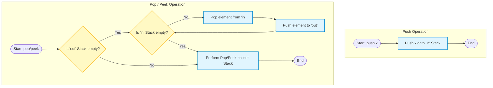

<h2><a href="https://leetcode.com/problems/implement-queue-using-stacks">232. Implement Queue using Stacks</a></h2>

<p>Implement a first in first out (FIFO) queue using only two stacks. The implemented queue should support all the functions of a normal queue (<code>push</code>, <code>peek</code>, <code>pop</code>, and <code>empty</code>).</p>

<p>Implement the <code>MyQueue</code> class:</p>

<ul>
	<li><code>void push(int x)</code> Pushes element x to the back of the queue.</li>
	<li><code>int pop()</code> Removes the element from the front of the queue and returns it.</li>
	<li><code>int peek()</code> Returns the element at the front of the queue.</li>
	<li><code>boolean empty()</code> Returns <code>true</code> if the queue is empty, <code>false</code> otherwise.</li>
</ul>

<p><strong>Notes:</strong></p>

<ul>
	<li>You must use <strong>only</strong> standard operations of a stack, which means only <code>push to top</code>, <code>peek/pop from top</code>, <code>size</code>, and <code>is empty</code> operations are valid.</li>
	<li>Depending on your language, the stack may not be supported natively. You may simulate a stack using a list or deque (double-ended queue) as long as you use only a stack's standard operations.</li>
</ul>

<p>&nbsp;</p>
<p><strong class="example">Example 1:</strong></p>

<pre><strong>Input</strong>
["MyQueue", "push", "push", "peek", "pop", "empty"]
[[], [1], [2], [], [], []]
<strong>Output</strong>
[null, null, null, 1, 1, false]

<strong>Explanation</strong>
MyQueue myQueue = new MyQueue();
myQueue.push(1); // queue is: [1]
myQueue.push(2); // queue is: [1, 2] (leftmost is front of the queue)
myQueue.peek(); // return 1
myQueue.pop(); // return 1, queue is [2]
myQueue.empty(); // return false
</pre>

<p>&nbsp;</p>
<p><strong>Constraints:</strong></p>

<ul>
	<li><code>1 &lt;= x &lt;= 9</code></li>
	<li>At most <code>100</code>&nbsp;calls will be made to <code>push</code>, <code>pop</code>, <code>peek</code>, and <code>empty</code>.</li>
	<li>All the calls to <code>pop</code> and <code>peek</code> are valid.</li>
</ul>

<p>&nbsp;</p>
<p><strong>Follow-up:</strong> Can you implement the queue such that each operation is <strong><a href="https://en.wikipedia.org/wiki/Amortized_analysis" target="_blank">amortized</a></strong> <code>O(1)</code> time complexity? In other words, performing <code>n</code> operations will take overall <code>O(n)</code> time even if one of those operations may take longer.</p>


---

# 🛍️ Implement-Queue-using-Stacks | Explained

## Approach 1: Lazy-Shifting Two-Stack Implementation (Amortized $O(1)$)

### Intuition
A stack is a Last-In, First-Out (LIFO) data structure, whereas a queue is a First-In, First-Out (FIFO) data structure. If we push elements onto a stack and then pop them off into another stack, the order of the elements is completely reversed. 

Think of this like two vertical tubes of Pringles chips:
1. **The `in` Stack (Tube A)**: You drop chips in from the top. The first chip dropped sits at the very bottom.
2. **The `out` Stack (Tube B)**: When you need to eat a chip (the one at the bottom of Tube A), you pour all the chips from Tube A into Tube B. Now, the chip that was at the bottom of Tube A is sitting at the very top of Tube B, ready to be eaten.

By lazily shifting elements from the `in` stack to the `out` stack *only* when the `out` stack is empty, we minimize unnecessary element movement, yielding an amortized runtime of $O(1)$ for retrieval operations.

### Algorithm Visualized



### Approach
1. **Two Stacks Design**: 
   - `in`: Dedicated exclusively to buffering newly pushed elements.
   - `out`: Dedicated exclusively to serving `pop` and `peek` requests.
2. **Push Logic**: 
   - Always push the element directly onto the `in` stack. This operation is trivially $O(1)$.
3. **Pop/Peek (Retrieve) Logic**:
   - Before popping or peeking, verify if the `out` stack is empty.
   - If `out` is empty, sequentially transfer all elements from `in` to `out`. This reverses their order, positioning the oldest element at the top of the `out` stack.
   - If `out` is not empty, bypass the transfer. The top of `out` is already the oldest active element in the queue.
   - Retrieve/remove the top element of the `out` stack.
4. **Empty Check Logic**:
   - The entire queue is empty if and only if **both** the `in` and `out` stacks are empty.

### Detailed Code Analysis

* **Lines 3-4**: 
  ```java
  Stack <Integer> in;
  Stack <Integer> out;
  ```
  Two instances of `java.util.Stack` are declared. Note that in professional Java development, `java.util.Stack` is a legacy class extending `java.util.Vector`, which uses synchronization locks on all operations. For a single-threaded queue simulation, standard modern practice would use `Deque<Integer> in = new ArrayDeque<>();` for optimal performance.

* **Lines 5-8**: 
  ```java
  public MyQueue() {
      in = new Stack<>();
      out = new Stack<>();
  }
  ```
  The constructor instantiates the concrete stacks on the heap.

* **Lines 10-13**: 
  ```java
  public void push(int x) {
      in.push(x);
  }
  ```
  New items are pushed onto the `in` stack in $O(1)$ time. No element transfers occur here (this is the "lazy" aspect).

* **Lines 15-18 & 20-23**: 
  ```java
  public int pop() {
      shiftStack();
      return out.pop();
  }
  
  public int peek() {
      shiftStack();
      return out.peek();
  }
  ```
  Both retrieval methods delegate to the private helper `shiftStack()` to ensure the FIFO invariant is satisfied before attempting to access the `out` stack. Once corrected, they access the element on the top of `out`.

* **Lines 25-27**: 
  ```java
  public boolean empty() {
      return in.isEmpty() && out.isEmpty();
  }
  ```
  Since queue elements can be split across both stacks during execution, the queue is only empty when both internal stacks are empty.

* **Lines 29-35**: 
  ```java
  private void shiftStack(){
      if(out.isEmpty()){
          while(!in.isEmpty()){
              out.push(in.pop());
          }
      }
  }
  ```
  This is the helper function managing the transfer. The outer conditional guard (`if(out.isEmpty())`) is critical. If we shifted elements from `in` to `out` while `out` still contained elements, the newer elements would be placed *above* the older elements in `out`, breaking the FIFO queue ordering.

### Code
```java
class MyQueue {

    Stack <Integer> in;
    Stack <Integer> out;
    public MyQueue() {
        in = new Stack<>();
        out = new Stack<>();
    }
    
    public void push(int x) {
        in.push(x);
    }
    
    public int pop() {
        shiftStack();
        return out.pop();
    }
    
    public int peek() {
        shiftStack();
        return out.peek();
    }
    
    public boolean empty() {
        return in.isEmpty() && out.isEmpty();
    }

    private void shiftStack(){
        if(out.isEmpty()){
            while(!in.isEmpty()){
                out.push(in.pop());
            }
        }
    }
}
```

### Complexity

- **Time Complexity:**
  - `push(x)`: $O(1)$. Pushing onto a stack is a constant-time operation.
  - `pop()` / `peek()`: **Amortized $O(1)$** (Worst-case $O(N)$). 
    * *Why is it amortized $O(1)$?* Each element is pushed to the `in` stack exactly once, popped from `in` exactly once, pushed to `out` exactly once, and popped from `out` exactly once. For $N$ insertions and deletions, the total number of operations performed across both stacks is $4N$, yielding an average of $4$ operations per element, which resolves to $O(1)$ amortized time.
  - `empty()`: $O(1)$. Direct checks on stack sizes.
- **Space Complexity:**
  - $O(N)$ auxiliary space, where $N$ is the number of elements active in the queue, since we store all items inside the two stacks.

---

## 🕵️‍♂️ Follow-up Questions

### 1. Why is standard modern practice to avoid `java.util.Stack` in production environments?
**Answer:** 
`java.util.Stack` is a legacy class that extends `java.util.Vector`. Because `Vector` is retrofitted with synchronized methods to make it thread-safe, every call to `.push()` or `.pop()` incurs synchronization overhead (acquiring and releasing reentrant monitor locks). 

In a modern, single-threaded context, `java.util.ArrayDeque` is the industry-standard recommendation for implementing stack behavior. It performs significantly faster because it is unsynchronized and uses a contiguous resizable array under the hood.

### 2. How would you modify this queue to make it thread-safe for highly concurrent environments?
**Answer:**
To make this implementation thread-safe, we must lock the entire read/write state. Simply using thread-safe stacks is not enough because the helper method `shiftStack()` is non-atomic; multiple threads could concurrently see `out.isEmpty()` as true and try to shift elements, causing data races.

We can achieve thread-safety using a `ReentrantReadWriteLock` or standard synchronized blocks:

```java
import java.util.concurrent.locks.ReentrantLock;

class MyConcurrentQueue {
    private final Deque<Integer> in = new ArrayDeque<>();
    private final Deque<Integer> out = new ArrayDeque<>();
    private final ReentrantLock lock = new ReentrantLock();

    public void push(int x) {
        lock.lock();
        try {
            in.push(x);
        } finally {
            lock.unlock();
        }
    }

    public int pop() {
        lock.lock();
        try {
            shiftStack();
            return out.pop();
        } finally {
            lock.unlock();
        }
    }
    
    // Similarly lock peek() and empty()
}
```