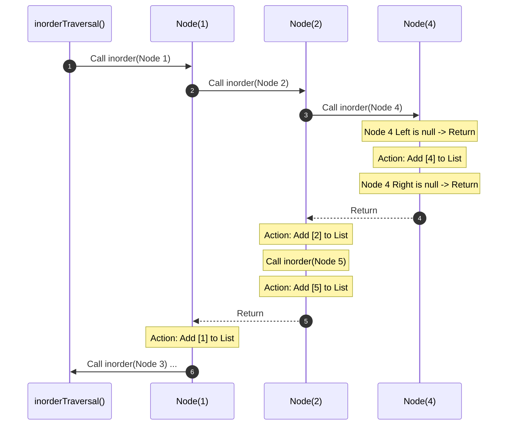

<h2><a href="https://leetcode.com/problems/binary-tree-inorder-traversal">94. Binary Tree Inorder Traversal</a></h2>

<p>Given the <code>root</code> of a binary tree, return <em>the inorder traversal of its nodes' values</em>.</p>

<p>&nbsp;</p>
<p><strong class="example">Example 1:</strong></p>

<div class="example-block">
<p><strong>Input:</strong> <span class="example-io">root = [1,null,2,3]</span></p>

<p><strong>Output:</strong> <span class="example-io">[1,3,2]</span></p>

<p><strong>Explanation:</strong></p>

<p></p>
</div>

<p><strong class="example">Example 2:</strong></p>

<div class="example-block">
<p><strong>Input:</strong> <span class="example-io">root = [1,2,3,4,5,null,8,null,null,6,7,9]</span></p>

<p><strong>Output:</strong> <span class="example-io">[4,2,6,5,7,1,3,9,8]</span></p>

<p><strong>Explanation:</strong></p>

<p></p>
</div>

<p><strong class="example">Example 3:</strong></p>

<div class="example-block">
<p><strong>Input:</strong> <span class="example-io">root = []</span></p>

<p><strong>Output:</strong> <span class="example-io">[]</span></p>
</div>

<p><strong class="example">Example 4:</strong></p>

<div class="example-block">
<p><strong>Input:</strong> <span class="example-io">root = [1]</span></p>

<p><strong>Output:</strong> <span class="example-io">[1]</span></p>
</div>

<p>&nbsp;</p>
<p><strong>Constraints:</strong></p>

<ul>
	<li>The number of nodes in the tree is in the range <code>[0, 100]</code>.</li>
	<li><code>-100 &lt;= Node.val &lt;= 100</code></li>
</ul>

<p>&nbsp;</p>
<strong>Follow up:</strong> Recursive solution is trivial, could you do it iteratively?

---

# 🛍️ Binary-Tree-Inorder-Traversal | Explained

## Approach 1: Recursive Depth-First Search (DFS)

### Intuition
To understand **Inorder Traversal** (Left $\rightarrow$ Root $\rightarrow$ Right), think of a corporate hierarchy where tasks are delegated downwards. A manager cannot complete their own report until their direct assistant (Left) completes theirs. Once the assistant finishes, the manager compiles their own portion (Root), and then allows the secondary assistant (Right) to complete their part. 

In computer science terms, this translates to a Depth-First Search (DFS) where we delay "visiting" (processing/adding to our list) the current node until we have fully explored and exhausted its entire left subtree.

### Algorithm Visualized

For a binary tree structured like this:
```
       1
      / \
     2   3
    / \
   4   5
```

The sequence of function calls and stack execution flows as follows:



The final order of values added to the list is: `[4, 2, 5, 1, 3]`.

### Approach
1. **Initialize helper list**: Create a dynamic array list `l` to collect the node values as we visit them.
2. **Define the recursive function (`inorder`)**:
   - **Base Case**: If the current node (`root`) is `null`, return immediately (we have hit a leaf node's child boundary).
   - **Step 1 (Go Left)**: Call `inorder` recursively on `root.left`. This winds up the call stack until we reach the leftmost node.
   - **Step 2 (Visit Root)**: Append `root.val` to our list `l`.
   - **Step 3 (Go Right)**: Call `inorder` recursively on `root.right`.
3. **Execute and Return**: Invoke the recursive function starting with the root node and return the populated list.

---

### Detailed Code Analysis

Let's break down your Java code block-by-block to see exactly how execution proceeds.

#### 1. The Recursive Helper Method
```java
public void inorder(TreeNode root, List <Integer> l){
    // base case
    if(root == null){
        return ;
    }

    //recursive call
    inorder(root.left, l);
    l.add(root.val);
    inorder(root.right, l);
}
```
* **Line 18**: The helper method accepts the current `TreeNode root` and the reference to our results list `l`. Passing the list reference directly avoids creating multiple list objects across recursive frames, keeping memory usage clean.
* **Lines 20-22**: The defensive base case `if(root == null)` checks if the recursion has traveled past a leaf node. If true, it returns `void`, popping the top frame off the JVM call stack.
* **Line 25**: `inorder(root.left, l)` halts execution of the current frame and pushes a new frame onto the call stack for the left child. This guarantees that **all** left descendants are processed before the current node.
* **Line 26**: `l.add(root.val)` is the processing step. This runs only when the left subtree has been fully traversed.
* **Line 27**: `inorder(root.right, l)` kicks off the traversal on the right subtree, applying the exact same rules.

#### 2. The Main Entry Method
```java
public List<Integer> inorderTraversal(TreeNode root) {
    List<Integer> l = new ArrayList <>();
    inorder(root, l);
    return l;
}
```
* **Line 31**: An `ArrayList` is instantiated. This data structure is ideal because it provides $O(1)$ amortized insertion time complexity.
* **Line 32**: The recursive process is bootstrapped by passing the root of the tree and our list reference.
* **Line 33**: Once the stack fully unwinds, the populated list `l` is returned.

---

### Code

```java
/**
 * Definition for a binary tree node.
 * public class TreeNode {
 *     int val;
 *     TreeNode left;
 *     TreeNode right;
 *     TreeNode() {}
 *     TreeNode(int val) { this.val = val; }
 *     TreeNode(int val, TreeNode left, TreeNode right) {
 *         this.val = val;
 *         this.left = left;
 *         this.right = right;
 *     }
 * }
 */
class Solution {

    public void inorder(TreeNode root, List <Integer> l){
        // base case
        if(root == null){
            return ;
        }

        //recursive call
        inorder(root.left, l);
        l.add(root.val);
        inorder(root.right, l);
    }

    public List<Integer> inorderTraversal(TreeNode root) {
        List<Integer> l = new ArrayList <>();
        inorder(root, l);
        return l;
    }
}
```

---

### Complexity

- **Time Complexity:** $\mathcal{O}(N)$
  We visit every single node in the binary tree exactly once. Thus, the time complexity scales linearly with the total number of nodes $N$.

- **Space Complexity:** $\mathcal{O}(H)$
  The space complexity is determined by the maximum size of the implicit JVM call stack. 
  - In the **average/best case** (a balanced binary tree), the height of the tree $H = \log N$, resulting in $\mathcal{O}(\log N)$ space.
  - In the **worst case** (a completely skewed/degenerate tree resembling a linked list), the height of the tree $H = N$, resulting in $\mathcal{O}(N)$ space.
  *(Note: The output list of size $O(N)$ is typically excluded from auxiliary space complexity calculations as it is required by the problem description).*

---

## 🕵️‍♂️ Follow-up Questions

### 1. How would you convert this recursive solution into an iterative one?
**Answer:**
To convert this to an iterative solution, we must mimic the recursive call stack manually using an explicit `Stack` data structure. 

```java
public List<Integer> inorderTraversal(TreeNode root) {
    List<Integer> result = new ArrayList<>();
    Stack<TreeNode> stack = new Stack<>();
    TreeNode curr = root;

    while (curr != null || !stack.isEmpty()) {
        // Keep traveling left and cache current path nodes
        while (curr != null) {
            stack.push(curr);
            curr = curr.left;
        }
        // Current is null, so pop the parent node and process it
        curr = stack.pop();
        result.add(curr.val);
        
        // Move to the right subtree
        curr = curr.right;
    }
    return result;
}
```

### 2. Can we achieve $\mathcal{O}(1)$ auxiliary space complexity?
**Answer:**
Yes, by using **Morris Traversal**. This algorithm temporarily modifies the tree structure by creating "threads" (temporary pointers from a predecessor node back to the current node). 

Before moving to the left subtree, we find the predecessor (the rightmost node of the left subtree) and point its `right` pointer to our current node. This allows us to find our way back up the tree without utilizing a stack or recursion. Once we return to the node, we restore the original tree structure by setting the predecessor's `right` back to `null`.