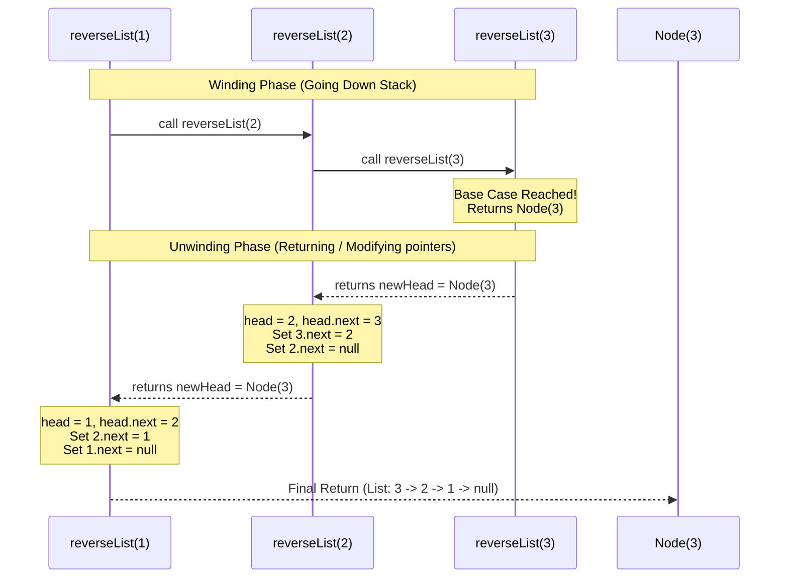

<h2><a href="https://leetcode.com/problems/reverse-linked-list">206. Reverse Linked List</a></h2>

<p>Given the <code>head</code> of a singly linked list, reverse the list, and return <em>the reversed list</em>.</p>

<p>&nbsp;</p>
<p><strong class="example">Example 1:</strong></p>

<pre><strong>Input:</strong> head = [1,2,3,4,5]
<strong>Output:</strong> [5,4,3,2,1]
</pre>

<p><strong class="example">Example 2:</strong></p>

<pre><strong>Input:</strong> head = [1,2]
<strong>Output:</strong> [2,1]
</pre>

<p><strong class="example">Example 3:</strong></p>

<pre><strong>Input:</strong> head = []
<strong>Output:</strong> []
</pre>

<p>&nbsp;</p>
<p><strong>Constraints:</strong></p>

<ul>
	<li>The number of nodes in the list is the range <code>[0, 5000]</code>.</li>
	<li><code>-5000 &lt;= Node.val &lt;= 5000</code></li>
</ul>

<p>&nbsp;</p>
<p><strong>Follow up:</strong> A linked list can be reversed either iteratively or recursively. Could you implement both?</p>


---

# 🛍️ Reverse-Linked-List | Explained

## Approach 1: Iterative Pointer Reversal
### Intuition
Imagine a train where each carriage is coupled to point to the next carriage ($1 \rightarrow 2 \rightarrow 3 \rightarrow \emptyset$). To reverse the direction of the train without using extra carriages, you must stand at the couplings and change them one by one. 

Because a singly-linked list node only points forward, once you break the link from carriage $A$ to carriage $B$ to make $A$ point backward, you lose the reference to $B$. To prevent losing the rest of the train, you must use a temporary pointer to hold onto the remaining unreversed portion of the list before flipping the current connection.

### Algorithm Visualized
```mermaid
graph LR
    subgraph State 0: Initial Setup
        node1[1] --> node2[2] --> node3[3] --> NULL1(null)
        curr1[curr] --> node1
        prev1[prev] --> NULL_prev(null)
    end

    subgraph State 1: Loop Step 1 (Save next, reverse link)
        node1_s1[1] --> NULL_prev
        node2_s1[2] --> node3_s1[3] --> NULL2(null)
        curr_s1[curr] --> node1_s1
        next_s1[next] --> node2_s1
    end

    subgraph State 2: Loop Step 2 (Move pointers forward)
        node1_s2[1] --> NULL_prev
        node2_s2[2] --> node3_s2[3] --> NULL3(null)
        prev_s2[prev] --> node1_s2
        curr_s2[curr] --> node2_s2
    end
```

### Approach
1. Initialize two pointers: `prev` as `null` and `curr` as the `head` of the list.
2. Traverse through the list using a `while` loop that continues until `curr` becomes `null`.
3. Inside the loop:
   - Save the next node: `next = curr.next`.
   - Reverse the pointer: `curr.next = prev`.
   - Shift the window forward: Move `prev` to `curr` and `curr` to `next`.
4. Return `prev` because when `curr` reaches `null`, `prev` will be pointing to the new head of the reversed list.

### Detailed Code Analysis
- **Lines 14-15 (`ListNode prev = null; ListNode curr = head;`):** We initialize `prev` to `null` because the original head node will become the tail node of the reversed list, and a tail node must point to `null`. We initialize `curr` to `head` to start the traversal.
- **Line 17 (`while(curr != null)`):** This loop drives the traversal. It guarantees that every node in the list gets processed.
- **Line 18 (`ListNode next = curr.next;`):** Crucial step. We temporarily cache the rest of the unreversed list. If we don't save this reference, we will lose access to the remaining nodes when we overwrite `curr.next` on the next line.
- **Line 20 (`curr.next = prev;`):** The actual reversal step. The current node points backward to the node processed before it (`prev`).
- **Lines 21-22 (`prev = curr; curr = next;`):** We step forward. `prev` moves to the node we just reversed (`curr`), and `curr` advances to the cached remainder of the list (`next`).
- **Line 24 (`return prev;`):** When the loop terminates, `curr` has slipped past the last element and is `null`. `prev` is left standing on the last element of the original list, which is now the first element of the reversed list.

### Code
```java
ListNode prev = null;
ListNode curr = head;

while(curr != null){
    ListNode next = curr.next;

    curr.next = prev;
    prev = curr;
    curr = next;
}
return prev;
```

### Complexity
- **Time:** $\mathcal{O}(N)$ where $N$ is the number of nodes in the linked list. We traverse the list exactly once.
- **Space:** $\mathcal{O}(1)$ auxiliary space. Only a few reference pointers (`prev`, `curr`, `next`) are created and updated in place.

---

## Approach 2: Recursive Backtracking
### Intuition
The recursive approach leverages the call stack to traverse to the end of the list first, and then reverses the pointers as the execution frames pop off the call stack. 

Think of it as a leap of faith: if you assume the sub-list starting from `head.next` is already successfully reversed, you get back the new head of that reversed list. Your only remaining task is to append the current `head` node to the very end of that reversed sub-list and set its own `next` pointer to `null`. Since `head.next` is still pointing to what used to be the next node (which is now the tail of the reversed sub-list), you can directly access that tail via `head.next` and make it point back to `head`.

### Algorithm Visualized


### Approach
1. **Base Case:** If the list is empty (`head == null`) or contains only a single node (`head.next == null`), return `head`. This acts as the boundary condition where no reversal is needed.
2. **Recursive Descent:** Call `reverseList(head.next)` recursively. This winds down to the end of the list, returning the new head of the completely reversed tail portion.
3. **Pointer Manipulation (Unwinding):** 
   - Identify the node immediately following the current node (`head.next`).
   - Point that node's `next` reference back to the current node: `head.next.next = head`.
   - Break the forward link of the current node to avoid cycles: `head.next = null`.
4. **Return:** Pass the `newHead` (which was found at the base case) all the way back up the call stack.

### Detailed Code Analysis
- **Lines 26-28 (`if(head == null || head.next == null) { return head; }`):** The base case. If the list is empty, we return `null`. If we reach the last node, we return that node. This last node will be preserved as the `newHead` value returned across all call frames.
- **Line 30 (`ListNode newHead = reverseList(head.next);`):** Recursively processes the sub-list. This line pauses execution of the current frame and waits for the nested frames to finish reversing the rest of the list.
- **Line 32 (`head.next.next = head;`):** This is the core magic of the recursive step. If our original list fragment is `head(1) -> tail(2) -> null`, and `tail(2)` has been reached, then `head.next` points to `2`. Therefore, `head.next.next = head` translates to `2.next = 1`.
- **Line 33 (`head.next = null;`):** If we don't sever this connection, we will introduce a circular cycle (`1 -> 2 -> 1`). Setting `head.next = null` ensures that the newly reversed head (which is now at the end of this sub-list segment) properly terminates.
- **Line 35 (`return newHead;`):** Returns the absolute head of the reversed list. Note that `newHead` is never modified during the unwinding phase; it is simply passed upward through the recursion frames.

### Code
```java
if(head == null || head.next == null){
    return head;
}

ListNode newHead = reverseList(head.next);

head.next.next = head;
head.next= null;

return newHead;
```

### Complexity
- **Time:** $\mathcal{O}(N)$ where $N$ is the number of nodes in the linked list. Each node in the list is visited once during the descent and once during the unwinding.
- **Space:** $\mathcal{O}(N)$ auxiliary space. This space is consumed by the implicit call stack during recursive execution. Since there are $N$ nodes, there will be $N$ active stack frames at the deepest point of recursion.

---

## 🕵️‍♂️ Follow-up Questions

### 1. What are the practical implications of choosing the Iterative approach over the Recursive approach?
In a real-world production environment, the **Iterative approach** is almost always preferred. While the recursive solution is elegant and shorter to write, its $\mathcal{O}(N)$ space complexity on the system call stack poses a high risk of a **StackOverflowError** if the linked list contains hundreds of thousands of nodes. The iterative solution runs in $\mathcal{O}(1)$ space, making it robust against memory-exhaustion issues regardless of list length.

### 2. How would you reverse a sub-portion of a linked list (e.g., from position $m$ to $n$)?
To reverse only a portion of the list, you would:
1. Traverse and locate the node right before the $m$-th position (let's call it `connection`).
2. Keep a reference to the $m$-th node itself (which will become the tail of the reversed sub-segment, let's call it `tail`).
3. Perform a standard iterative pointer reversal from position $m$ to $n$.
4. Connect the `connection` node to the head of the newly reversed sub-segment, and connect the `tail` node to the $(n+1)$-th node to splice the reversed portion cleanly back into the main list.