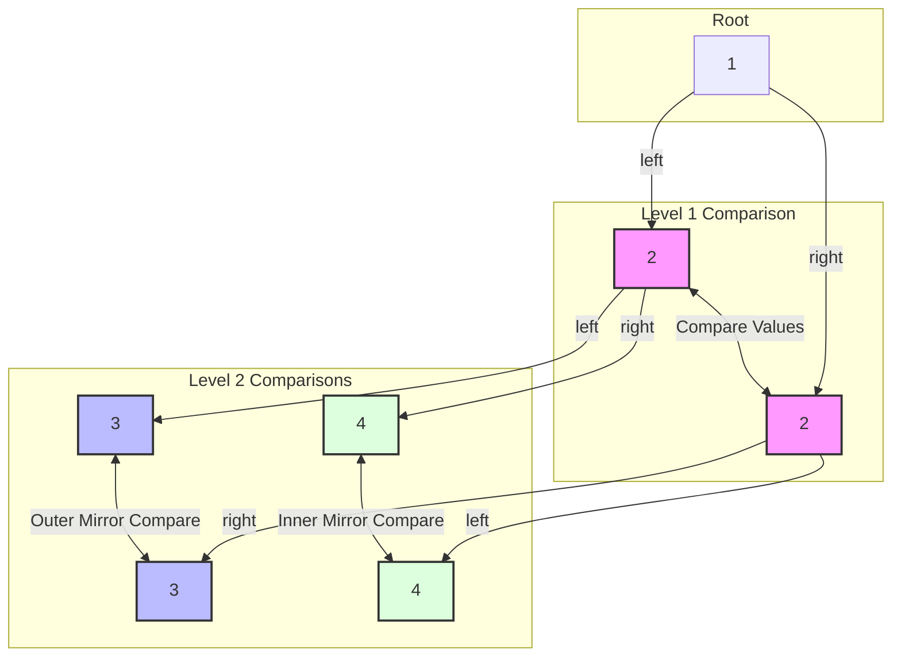

<h2><a href="https://leetcode.com/problems/symmetric-tree">101. Symmetric Tree</a></h2>

<p>Given the <code>root</code> of a binary tree, <em>check whether it is a mirror of itself</em> (i.e., symmetric around its center).</p>

<p>&nbsp;</p>
<p><strong class="example">Example 1:</strong></p>

<pre><strong>Input:</strong> root = [1,2,2,3,4,4,3]
<strong>Output:</strong> true
</pre>

<p><strong class="example">Example 2:</strong></p>

<pre><strong>Input:</strong> root = [1,2,2,null,3,null,3]
<strong>Output:</strong> false
</pre>

<p>&nbsp;</p>
<p><strong>Constraints:</strong></p>

<ul>
	<li>The number of nodes in the tree is in the range <code>[1, 1000]</code>.</li>
	<li><code>-100 &lt;= Node.val &lt;= 100</code></li>
</ul>

<p>&nbsp;</p>
<strong>Follow up:</strong> Could you solve it both recursively and iteratively?

---

# 🛍️ Symmetric-Tree | Explained

## Approach 1: Recursive Mirror Traversal (Depth-First Search)

### Intuition
To understand if a binary tree is symmetric around its center, imagine looking at yourself in a mirror. Your **left** hand corresponds to the mirror image's **right** hand, and your **right** hand corresponds to the mirror image's **left** hand. 

For a binary tree to be symmetric:
1. The root's left subtree and right subtree must be mirror images of each other.
2. Two trees are mirror images if:
   - Their root values are identical.
   - The **left** child of the left tree is a mirror image of the **right** child of the right tree.
   - The **right** child of the left tree is a mirror image of the **left** child of the right tree.

This dual-tracking relationship naturally lends itself to a recursive Depth-First Search (DFS) where we traverse two nodes simultaneously, moving in opposite directions.

### Algorithm Visualized

The diagram below shows how the algorithm traverses the tree to verify symmetry. The colored links indicate which nodes are compared at each step of the recursion.



### Approach
1. **Entry Point (`isSymmetric`)**: Kick off the recursion by passing the left and right children of the root to the helper function `isMirror`.
2. **Base Cases (`isMirror`)**:
   - **Both Null**: If both compared nodes (`left` and `right`) are `null`, we have reached the bottom of a symmetric branch. Return `true`.
   - **One Null**: If only one of the nodes is `null` (and the other is not), the structural symmetry is broken. Return `false`.
   - **Value Mismatch**: If both nodes exist but their values do not match (`left.val != right.val`), symmetry is broken. Return `false`.
3. **Recursive Step**:
   - Recursively check if the outer children are mirrors: `isMirror(left.left, right.right)`.
   - Recursively check if the inner children are mirrors: `isMirror(left.right, right.left)`.
   - Return `true` if and only if both recursive checks return `true` (using the logical `&&` operator).

### Detailed Code Analysis

Let's dissect your implementation line-by-line:

* **Lines 17–19**:
  ```java
  public boolean isSymmetric(TreeNode root) {
      return isMirror(root.left, root.right);
  }
  ```
  * **Analysis**: This is the entry point. It delegates the main structural comparison to the helper function `isMirror`. 
  * **Senior Review Note (Defensive Design)**: If the input `root` can be `null`, this line will throw a `NullPointerException` when trying to access `root.left`. While LeetCode's constraints state that the number of nodes is in the range `[1, 1000]`, in a production codebase, you should always handle this edge case defensively by checking `if (root == null) return true;`.

* **Line 21**:
  ```java
  public boolean isMirror (TreeNode left, TreeNode right){
  ```
  * **Analysis**: Declares the helper method. It tracks two distinct nodes (`left` and `right`) moving down mirrored paths simultaneously.

* **Line 22**:
  ```java
  if(left== null && right== null) return true;
  ```
  * **Analysis**: The first base case. If both subtrees are empty, they are symmetrical mirrors of each other. This is crucial for stopping the recursion at the leaf nodes.

* **Line 24**:
  ```java
  if(left == null || right == null) return false;
  ```
  * **Analysis**: The second base case. Because we already checked if *both* are null on line 22, arriving here means at least one is not null. If either one of them is null, it indicates an asymmetric tree structure (one side has a node where the other does not). Hence, we return `false`.

* **Line 26**:
  ```java
  if(left.val != right.val)return false;
  ```
  * **Analysis**: The third base case. If both nodes exist, we compare their payload values. If they differ, the tree is asymmetric.

* **Lines 28–29**:
  ```java
  return isMirror(left.left, right.right) &&
      isMirror(left.right, right.left);
  ```
  * **Analysis**: This is the heart of the recursive traversal. 
    * `isMirror(left.left, right.right)` checks the **outer** boundary.
    * `isMirror(left.right, right.left)` checks the **inner** boundary.
    * The JVM evaluates these expressions lazily. If the first recursive call returns `false`, the second call is skipped entirely (short-circuiting), optimizing CPU cycles.

### Code

```java
/**
 * Definition for a binary tree node.
 * public class TreeNode {
 *     int val;
 *     TreeNode left;
 *     TreeNode right;
 *     TreeNode() {}
 *     TreeNode(int val) { this.val = val; }
 *     TreeNode(int val, TreeNode left, TreeNode right) {
 *         this.val = val;
 *         this.left = left;
 *         this.right = right;
 *     }
 * }
 */
class Solution {
    public boolean isSymmetric(TreeNode root) {
        // Defensive check for production environments:
        if (root == null) return true;
        
        return isMirror(root.left, root.right);
    }

    public boolean isMirror (TreeNode left, TreeNode right){
        // Base Case 1: Both paths terminated. Symmetric up to this point.
        if (left == null && right == null) return true;

        // Base Case 2: One path terminated but the other did not. Asymmetric.
        if (left == null || right == null) return false;

        // Base Case 3: Value mismatch. Asymmetric.
        if (left.val != right.val) return false;

        // Recursive Step: Outer matching && Inner matching
        return isMirror(left.left, right.right) &&
               isMirror(left.right, right.left);
    }
}
```

### Complexity
- **Time Complexity:** $\mathcal{O}(N)$
  We visit every single node in the binary tree exactly once in the worst-case scenario (when the tree is perfectly symmetric). Thus, the runtime scales linearly with the number of nodes $N$.
- **Space Complexity:** $\mathcal{O}(H)$ (where $H$ is the height of the tree)
  The space complexity is determined by the maximum depth of the call stack. 
  - In the **worst case** (a completely skewed, linear tree), the height $H = N$, giving a space complexity of $\mathcal{O}(N)$.
  - In the **best case** (a perfectly balanced tree), the height $H = \log(N)$, giving a space complexity of $\mathcal{O}(\log N)$.

---

## 🕵️‍♂️ Follow-up Questions

### 1. How would you solve this problem iteratively?
Interviewers frequently ask to convert recursive DFS solutions to iterative ones to prevent stack overflow issues. We can achieve this using a queue to perform a Breadth-First Search (BFS)-like traversal, processing nodes in pairs.

#### Iterative Solution Code:
```java
import java.util.LinkedList;
import java.util.Queue;

class Solution {
    public boolean isSymmetric(TreeNode root) {
        if (root == null) return true;

        // Use a queue to hold pairs of nodes to compare
        Queue<TreeNode> queue = new LinkedList<>();
        queue.add(root.left);
        queue.add(root.right);

        while (!queue.isEmpty()) {
            TreeNode t1 = queue.poll();
            TreeNode t2 = queue.poll();

            // If both are null, they are symmetric; continue matching the rest
            if (t1 == null && t2 == null) continue;
            // If only one is null, or values do not match, it is asymmetric
            if (t1 == null || t2 == null) return false;
            if (t1.val != t2.val) return false;

            // Add children in mirror order:
            // Outer pair
            queue.add(t1.left);
            queue.add(t2.right);
            // Inner pair
            queue.add(t1.right);
            queue.add(t2.left);
        }
        return true;
    }
}
```

### 2. Can we solve this by performing an In-Order traversal and checking if the resulting array/list is a palindrome?
**No, not reliably without capturing null structures.** 

A common pitfall is thinking that a tree is symmetric if its in-order traversal reads the same forwards and backwards. Consider this counterexample:
```
    1
   / \
  2   2
   \   \
    3   3
```
An in-order traversal of this tree is `[2, 3, 1, 2, 3]`, which is a palindrome. However, the tree is clearly **not** symmetric (both `3`s are right-children, so they lean the same way). 

To make this approach work, you must explicitly store `null` placeholders in your traversal list to capture the structural topology of the tree, which degrades space efficiency compared to the direct recursive or iterative solutions.