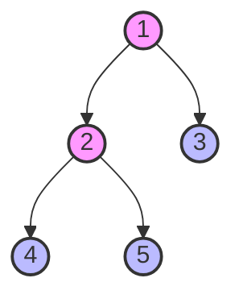
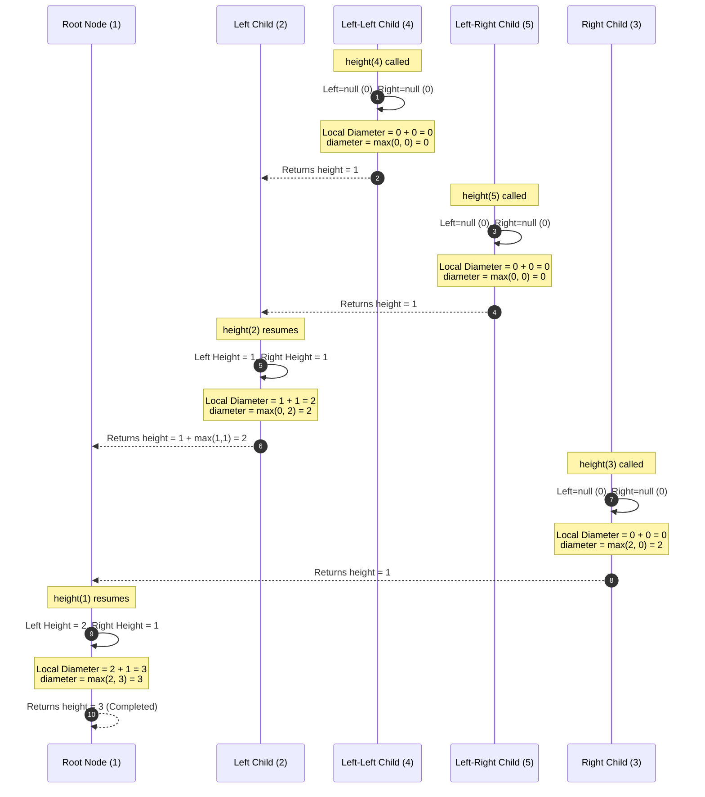

<h2><a href="https://leetcode.com/problems/diameter-of-binary-tree">543. Diameter of Binary Tree</a></h2>

<p>Given the <code>root</code> of a binary tree, return <em>the length of the <strong>diameter</strong> of the tree</em>.</p>

<p>The <strong>diameter</strong> of a binary tree is the <strong>length</strong> of the longest path between any two nodes in a tree. This path may or may not pass through the <code>root</code>.</p>

<p>The <strong>length</strong> of a path between two nodes is represented by the number of edges between them.</p>

<p>&nbsp;</p>
<p><strong class="example">Example 1:</strong></p>

<pre><strong>Input:</strong> root = [1,2,3,4,5]
<strong>Output:</strong> 3
<strong>Explanation:</strong> 3 is the length of the path [4,2,1,3] or [5,2,1,3].
</pre>

<p><strong class="example">Example 2:</strong></p>

<pre><strong>Input:</strong> root = [1,2]
<strong>Output:</strong> 1
</pre>

<p>&nbsp;</p>
<p><strong>Constraints:</strong></p>

<ul>
	<li>The number of nodes in the tree is in the range <code>[1, 10<sup>4</sup>]</code>.</li>
	<li><code>-100 &lt;= Node.val &lt;= 100</code></li>
</ul>


---

# 🛍️ Diameter-of-Binary-Tree | Explained

## Approach 1: Bottom-Up Depth-First Search (Post-Order Traversal)

### Intuition
To find the diameter of a binary tree (the longest path between any two nodes), we must recognize that this longest path has a "highest point" or a "pivot node" somewhere in the tree. For any given node acting as this pivot, the longest path passing through it is the sum of the maximum depth (height) of its left subtree and the maximum depth (height) of its right subtree.

Think of it like a suspension bridge: at every node, we measure the length of the longest cable hanging down to the left, and the longest cable hanging down to the right. The longest bridge we can build through this node is the sum of these two cables. 

Instead of recalculating the height of subtrees repeatedly (which would lead to an inefficient $O(N^2)$ brute-force approach), we can compute the heights bottom-up in a single post-order traversal ($O(N)$). As we compute the height of each node, we simultaneously compute the potential diameter passing through it and update a global tracker `diameter` if we find a new maximum.

### Algorithm Visualized

For a binary tree: `[1, 2, 3, 4, 5]`



Below is the execution flow of the recursive call stack. We compute height from the bottom up, updating the global `diameter` state at each node:



### Approach
1. **Initialize a Global State Tracker:** Define an instance variable `diameter` set to `0`. This variable acts as an accumulator that will continuously retain the maximum diameter found across all subtrees.
2. **Execute Bottom-Up DFS (Post-Order Traversal):** We invoke a helper recursive function `height(TreeNode node)` starting at the `root`.
3. **Define Base Case:** If the current node is `null`, it contributes `0` to the height of its parent.
4. **Recursively Gather Subtree Information:** 
   - Compute `leftHeight` by calling `height(node.left)`.
   - Compute `rightHeight` by calling `height(node.right)`.
5. **Update Global Diameter (The Pivot Calculation):** Calculate the potential path passing through the current node as `leftHeight + rightHeight`. Update `diameter` if this sum is greater than the current maximum:
   $$\text{diameter} = \max(\text{diameter}, \text{leftHeight} + \text{rightHeight})$$
6. **Return Height to Parent Node:** To allow the parent caller to compute its path, return the height of the current subtree: 
   $$\text{height} = 1 + \max(\text{leftHeight}, \text{rightHeight})$$
7. **Return Result:** After the recursion completes, return the final value accumulated in the `diameter` variable.

### Detailed Code Analysis

Let's dissect the exact implementation line-by-line:

* **Line 17: `int diameter = 0;`**
  This is an instance field. While simple and clean for LeetCode, in production code, this pattern is **not thread-safe** if multiple threads share the same instance of `Solution`. (See follow-up questions for how to write this in a pure-functional, thread-safe manner).
* **Lines 18–21: `public int diameterOfBinaryTree(TreeNode root)`**
  This is the entry point. It invokes the helper `height(root)` method to kick off the recursion. Crucially, the return value of `height(root)` (the overall tree height) is discarded, and the updated `diameter` state is returned instead.
* **Line 25: `if(node == null) return 0;`**
  This is the recursive termination base case. If a leaf node has a `null` child, that child has a height of `0`.
* **Lines 27–28: `int leftHeight = height(node.left);` and `int rightHeight = height(node.right);`**
  These lines initiate the post-order depth-first search. The execution branches down to the lowest leaf nodes before executing any arithmetic operations.
* **Line 30: `diameter = Math.max(diameter, leftHeight + rightHeight);`**
  This is where the magic happens. The sum `leftHeight + rightHeight` represents the number of edges on the longest path between a leaf in the left subtree and a leaf in the right subtree that passes through the current `node`.
* **Line 32: `return 1 + Math.max(leftHeight, rightHeight);`**
  The current node must report its own height back to its parent. The height of a tree is defined as $1$ (for the current node itself) plus the maximum height of its two subtrees.

### Code
```java
/**
 * Definition for a binary tree node.
 * public class TreeNode {
 *     int val;
 *     TreeNode left;
 *     TreeNode right;
 *     TreeNode() {}
 *     TreeNode(int val) { this.val = val; }
 *     TreeNode(int val, TreeNode left, TreeNode right) {
 *         this.val = val;
 *         this.left = left;
 *         this.right = right;
 *     }
 * }
 */
class Solution {
    int diameter = 0;
    public int diameterOfBinaryTree(TreeNode root) {
        height(root);
        return diameter;        
    }

    public int height(TreeNode node){

        if(node == null) return 0;

        int leftHeight = height(node.left);
        int rightHeight = height(node.right);

        diameter = Math.max(diameter, leftHeight + rightHeight);

        return 1 + Math.max(leftHeight, rightHeight);
    }
}
```

### Complexity
- **Time Complexity:** $\mathcal{O}(N)$, where $N$ is the total number of nodes in the binary tree. We visit each node exactly once to calculate its height and update the maximum diameter.
- **Space Complexity:** $\mathcal{O}(H)$, where $H$ is the height of the tree. This is the space used by the recursive call stack.
  - In the **worst-case** (a skewed, degenerate tree resembling a linked list), the height is $H = N$, giving $\mathcal{O}(N)$ space complexity.
  - In the **best-case** (a fully balanced tree), the height is $H = \log_2 N$, giving $\mathcal{O}(\log N)$ space complexity.

---

## 🕵️‍♂️ Follow-up Questions

### 1. Your code uses an instance variable `int diameter`. Why is this a bad design pattern in a multi-threaded production environment, and how would you fix it?

**Answer:**
Using instance variables to maintain state across recursive functions is considered a bad practice in production systems because it makes the class **stateful** and **non-thread-safe**. If two different threads call `diameterOfBinaryTree` on the same `Solution` instance simultaneously, they will overwrite each other's `diameter` state, leading to race conditions and corrupt outputs.

To make the code thread-safe and purely functional, we can pass a single-element array `int[] maxDiameter` through the recursive helper, or return both the height and diameter from each recursive call wrapped in a custom result object (or array):

```java
class Solution {
    public int diameterOfBinaryTree(TreeNode root) {
        int[] maxDiameter = new int[1]; // Thread-local state container passed down stack
        calculateHeight(root, maxDiameter);
        return maxDiameter[0];
    }

    private int calculateHeight(TreeNode node, int[] maxDiameter) {
        if (node == null) return 0;
        
        int leftHeight = calculateHeight(node.left, maxDiameter);
        int rightHeight = calculateHeight(node.right, maxDiameter);
        
        // Mutate the local state container safely inside the stack frame
        maxDiameter[0] = Math.max(maxDiameter[0], leftHeight + rightHeight);
        
        return 1 + Math.max(leftHeight, rightHeight);
    }
}
```

### 2. Can we solve this problem iteratively without recursion to avoid call stack overflow on deep trees?

**Answer:**
Yes, we can solve this iteratively by performing a post-order traversal using a `Stack` and tracking the computed heights of the nodes in a `Map<TreeNode, Integer>`. 

We visit nodes in a bottom-up order:
1. Traverse down to the leftmost node, pushing parents onto the stack.
2. For each node, check if its right child has been processed. If not, transition to the right child.
3. Once both children of a node are processed, retrieve their computed heights from the map, update the global diameter, compute the current node's height, store it in the map, and pop the node off the stack.

While this protects against recursion-induced stack overflow, it increases the practical memory footprint because of the `Map` overhead.