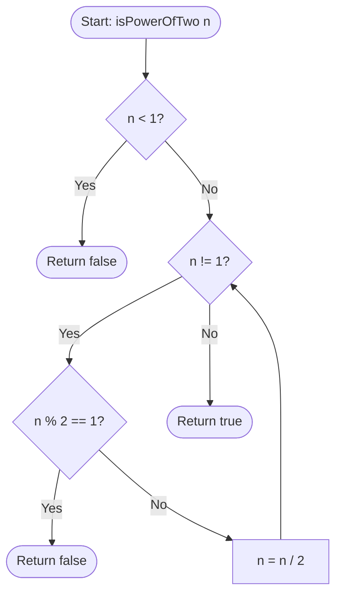
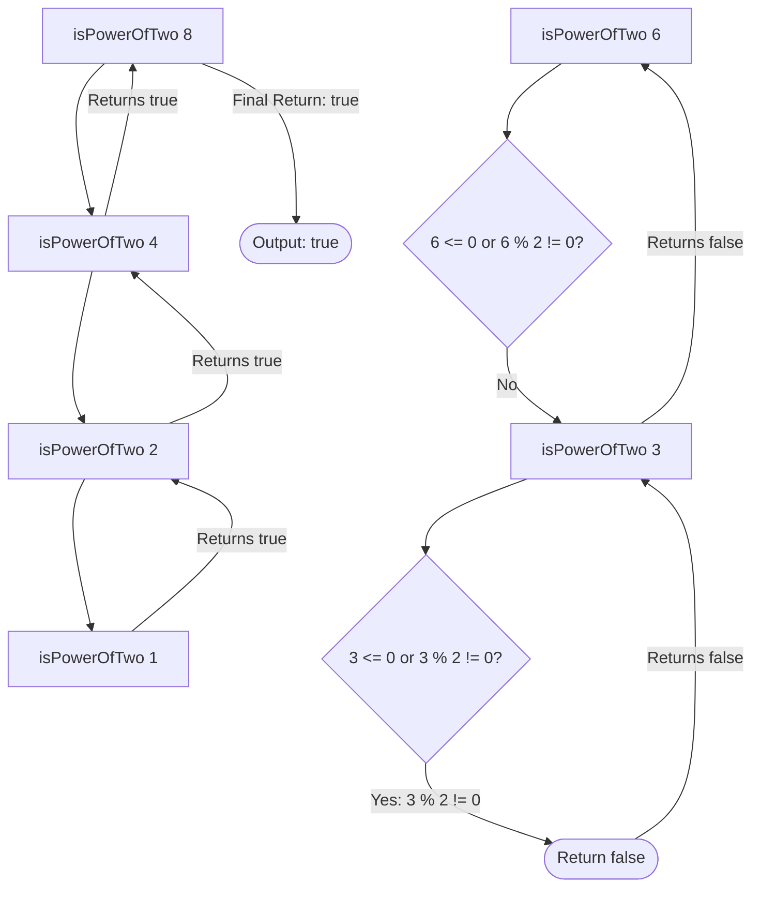

<h2><a href="https://leetcode.com/problems/power-of-two">231. Power of Two</a></h2>

<p>Given an integer <code>n</code>, return <em><code>true</code> if it is a power of two. Otherwise, return <code>false</code></em>.</p>

<p>An integer <code>n</code> is a power of two, if there exists an integer <code>x</code> such that <code>n == 2<sup>x</sup></code>.</p>

<p>&nbsp;</p>
<p><strong class="example">Example 1:</strong></p>

<pre><strong>Input:</strong> n = 1
<strong>Output:</strong> true
<strong>Explanation: </strong>2<sup>0</sup> = 1
</pre>

<p><strong class="example">Example 2:</strong></p>

<pre><strong>Input:</strong> n = 16
<strong>Output:</strong> true
<strong>Explanation: </strong>2<sup>4</sup> = 16
</pre>

<p><strong class="example">Example 3:</strong></p>

<pre><strong>Input:</strong> n = 3
<strong>Output:</strong> false
</pre>

<p>&nbsp;</p>
<p><strong>Constraints:</strong></p>

<ul>
	<li><code>-2<sup>31</sup> &lt;= n &lt;= 2<sup>31</sup> - 1</code></li>
</ul>

<p>&nbsp;</p>
<strong>Follow up:</strong> Could you solve it without loops/recursion?

---

# 🛍️ Power-of-Two | Explained

## Approach 1: Iterative Division (Commented-Out Code)

### Intuition
The core intuition behind this approach is the fundamental definition of a power of two: a number that can be expressed as $2^x$ where $x$ is a non-negative integer. If we repeatedly divide a power of two by 2, we will eventually reach 1 without ever encountering an odd quotient. 

Think of this like repeatedly folding a strip of paper in half. If the original length of the paper is a power of two (e.g., 16 inches), you can keep folding it perfectly in half (8, 4, 2, 1) until you have a single unit. If you start with a length that is not a power of two (e.g., 12 inches), folding it in half gives you 6, then 3, at which point you cannot fold it evenly into integers anymore.

### Algorithm Visualized



### Approach
1. **Sanity Check:** If the input $n$ is less than 1, it cannot be a power of two (since $2^x > 0$ for all real $x$, and the problem assumes integer exponents where $2^0 = 1$).
2. **Looping Reduction:** Enter a `while` loop that runs as long as $n$ is not equal to 1.
3. **Parity Check:** Inside the loop, check if $n$ is odd using the modulo operator (`n % 2 == 1`). If it is odd and not 1, it cannot be a power of two. Return `false` immediately.
4. **Division:** If $n$ is even, divide it by 2 (`n /= 2`) and continue the loop.
5. **Termination:** If the loop terminates because $n$ has been successfully reduced to 1, return `true`.

### Detailed Code Analysis
This analysis covers lines 3 through 8 of your original submission:

```java
if(n < 1) return false;
while(n != 1){
    if(n % 2 == 1) return false;
    n /= 2;
}
return true;
```

* **`if(n < 1) return false;`**: This acts as a guard clause. Negative numbers and zero are filtered out immediately.
* **`while(n != 1)`**: This loop drives the reduction. We do not need to process 1 because $2^0 = 1$, which is our target base state.
* **`if(n % 2 == 1) return false;`**: The `%` (modulo) operator finds the remainder of division by 2. If the remainder is 1, $n$ is odd (e.g., $n = 6 \rightarrow 3 \rightarrow$ odd, returns `false`).
* **`n /= 2;`**: This is a compound assignment operator equivalent to `n = n / 2`. It performs integer division, shifting the binary representation of $n$ to the right by one bit.
* **`return true;`**: If $n$ successfully reduces to 1, the loop exits, confirming $n$ is a power of two.

### Code
```java
class Solution {
    public boolean isPowerOfTwo(int n) {
        if (n < 1) return false;
        while (n != 1) {
            if (n % 2 == 1) return false;
            n /= 2;
        }
        return true;
    }
}
```

### Complexity
- **Time:** $O(\log n)$  
  In the worst-case scenario (when $n$ is indeed a power of two), the input $n$ is halved in each step of the loop. The number of iterations is proportional to the binary logarithm of $n$, $\log_2(n)$.
- **Space:** $O(1)$  
  This approach executes in-place, using only a constant amount of extra memory to track the state of the variable $n$.

---

## Approach 2: Recursive Division (Active Code)

### Intuition
This approach reframes the iterative division as a recursive reduction. The mathematical definition of a power of two can be defined inductively:
- $1$ is a power of two (Base Case: $2^0$).
- Any even number $n > 0$ is a power of two if and only if $n/2$ is a power of two (Recursive Step).

We delegate the verification of $n$ to the verification of its half, repeating this process until we either hit a base case that proves it is a power of two ($n = 1$) or a base case that disproves it ($n \le 0$ or $n$ is odd).

### Algorithm Visualized



### Approach
1. **Base Case 1 (Success):** If the input $n$ is exactly 1, return `true`.
2. **Base Case 2 (Failure):** If the input $n$ is less than or equal to 0, or if it is an odd number (checked via `n % 2 != 0`), it cannot be a power of two. Return `false`.
3. **Recursive Step:** If neither base case is met, $n$ must be an even number greater than 1. Return the result of the recursive call to `isPowerOfTwo(n / 2)`.

### Detailed Code Analysis
This analysis maps directly to lines 10 through 13 of your original submission:

```java
if(n == 1) return true;
if(n<=0 || n%2 !=0) return false;

return isPowerOfTwo(n/2);
```

* **`if(n == 1) return true;`**: The terminating success condition. If the stack resolves down to 1, the original input was a power of two.
* **`if(n<=0 || n%2 !=0) return false;`**:
  - `n <= 0`: Catches negative numbers and zero.
  - `||`: The logical OR operator utilizes short-circuit evaluation. If `n <= 0` is true, it immediately returns `false` without evaluating `n % 2 != 0` (preventing potential errors).
  - `n % 2 != 0`: This handles odd numbers. Checking `!= 0` is highly robust because it correctly catches odd negative numbers as well (as `n % 2` can evaluate to `-1` in Java).
* **`return isPowerOfTwo(n/2);`**: The recursive call. The execution suspends the current stack frame and pushes a new frame with the argument divided by 2.

### Code
```java
class Solution {
    public boolean isPowerOfTwo(int n) {
        if (n == 1) return true;
        if (n <= 0 || n % 2 != 0) return false;

        return isPowerOfTwo(n / 2);
    }
}
```

### Complexity
- **Time:** $O(\log n)$  
  Similar to the iterative approach, the input is halved with each recursive call. The maximum depth of the call stack is $\log_2(n) + 1$.
- **Space:** $O(\log n)$  
  Unlike the iterative solution, this approach incurs an $O(\log n)$ space complexity overhead because each recursive step allocates a new frame on the call stack. For a maximum 32-bit signed integer value ($2^{31}-1$), this means up to 31 concurrent stack frames.

---

## 🕵️‍♂️ Follow-up Questions

### 1. How can we optimize this solution to run in $O(1)$ Time and $O(1)$ Space?
An interviewer will almost always ask for an $O(1)$ solution using bitwise operations. 

**Answer:**
A binary number that is a power of two has exactly **one** set bit (e.g., $8 = 1000_2$, $16 = 10000_2$). 
If we subtract 1 from a power of two, all bits after the set bit become 1, and the set bit itself becomes 0 (e.g., $7 = 0111_2$). 

If we perform a bitwise AND (`&`) between $n$ and $n-1$:
- For a power of two: `1000 & 0111 = 0000` (evaluates to 0).
- For non-powers of two: the result will be non-zero.

```java
public boolean isPowerOfTwo(int n) {
    return n > 0 && (n & (n - 1)) == 0;
}
```

### 2. Why is the iterative approach generally preferred over the recursive approach in a production environment?
**Answer:**
Even though both approaches share the same $O(\log n)$ time complexity, the recursive approach is susceptible to **Stack Overflow Errors** if the recursion depth gets too large (though practically capped at 31 frames for 32-bit integers, in other languages or with larger data types like `BigInteger` this becomes critical). 

Furthermore, the iterative approach avoids the CPU overhead of allocating and deallocating stack frames (saving register state, return addresses, and local parameters), making it more performant and memory-efficient.