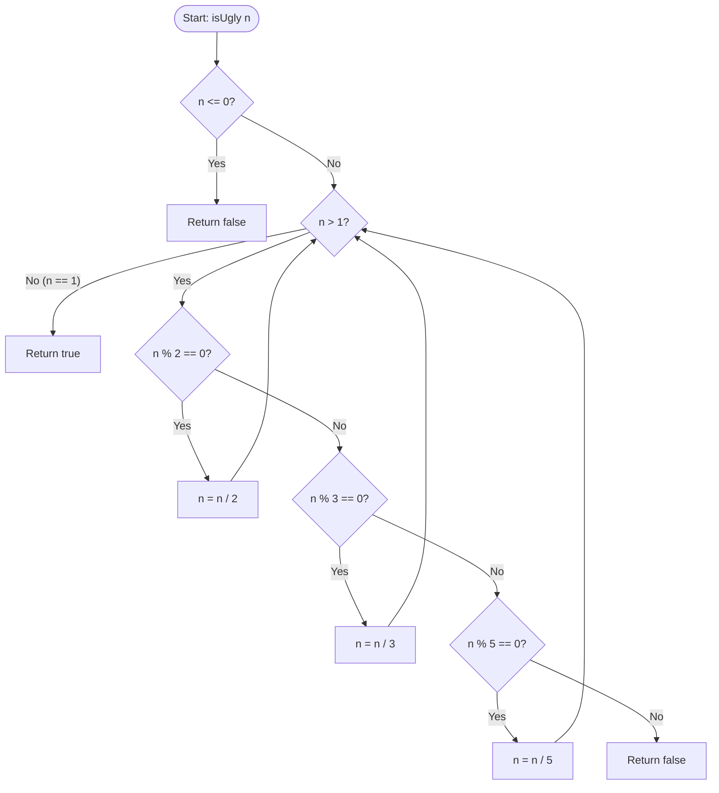

<h2><a href="https://leetcode.com/problems/ugly-number">263. Ugly Number</a></h2>

<p>An <strong>ugly number</strong> is a <em>positive</em> integer which does not have a prime factor other than 2, 3, and 5.</p>

<p>Given an integer <code>n</code>, return <code>true</code> <em>if</em> <code>n</code> <em>is an <strong>ugly number</strong></em>.</p>

<p>&nbsp;</p>
<p><strong class="example">Example 1:</strong></p>

<pre><strong>Input:</strong> n = 6
<strong>Output:</strong> true
<strong>Explanation:</strong> 6 = 2 × 3
</pre>

<p><strong class="example">Example 2:</strong></p>

<pre><strong>Input:</strong> n = 1
<strong>Output:</strong> true
<strong>Explanation:</strong> 1 has no prime factors.
</pre>

<p><strong class="example">Example 3:</strong></p>

<pre><strong>Input:</strong> n = 14
<strong>Output:</strong> false
<strong>Explanation:</strong> 14 is not ugly since it includes the prime factor 7.
</pre>

<p>&nbsp;</p>
<p><strong>Constraints:</strong></p>

<ul>
	<li><code>-2<sup>31</sup> &lt;= n &lt;= 2<sup>31</sup> - 1</code></li>
</ul>


---

# 🛍️ Ugly-Number | Explained

## Approach 1: Iterative Prime Factor Reduction (Trial Division)
### Intuition
An "ugly number" is defined as a positive integer whose prime factors are limited to $2$, $3$, and $5$. 

Think of this process like a security screening or filtering system. If we have a number $n$, we want to strip away all of its "allowed" prime factors ($2$, $3$, and $5$) by dividing the number by them as many times as possible. 
* If we successfully reduce $n$ down to $1$, it means the number was composed **entirely** of these allowed prime factors.
* If we find ourselves stuck at a value greater than $1$ that cannot be divided by $2$, $3$, or $5$, then some "forbidden" prime factor (like $7$, $11$, $13$, etc.) is protecting the remainder of the number. Thus, it cannot be an ugly number.

### Algorithm Visualized


### Approach
1. **Sanity Check:** If the input $n$ is less than or equal to $0$, immediately return `false`. Negative numbers and zero cannot be ugly numbers because their prime factorizations do not consist solely of $2, 3,$ and $5$ (specifically, $0$ has infinitely many prime factors, and negative numbers are not defined as ugly numbers).
2. **Iterative Reduction:** Enter a `while` loop that continues as long as $n > 1$.
3. **Sequential Factorization:** 
   * Check if $n$ is divisible by $2$ (`n % 2 == 0`). If so, divide $n$ by $2$.
   * If not, check if $n$ is divisible by $3$ (`n % 3 == 0`). If so, divide $n$ by $3$.
   * If not, check if $n$ is divisible by $5$ (`n % 5 == 0`). If so, divide $n$ by $5$.
   * If $n$ is not divisible by any of these but is still greater than $1$, it means a prime factor other than $2, 3,$ or $5$ exists. Return `false` immediately.
4. **Completion:** If the loop terminates because $n$ has been reduced to $1$, return `true`.

### Detailed Code Analysis
Let's trace the exact lines of your solution:

* **Lines 3–5:**
  ```java
  if (n <= 0) {
      return false;
  }
  ```
  *This acts as the guard clause.* It prevents infinite loops for $n \le 0$. If $n = 0$, the modulo checks `0 % 2 == 0` would match, leading to an infinite division of `0 / 2 = 0`. Negative inputs would also cause problems or incorrect evaluations.

* **Line 6:**
  ```java
  while (n > 1) {
  ```
  *The loop invariant.* We only need to reduce $n$ if it is strictly greater than $1$. If $n = 1$ initially, the loop is skipped, and the code correctly returns `true` on Line 17 (since $1$ is defined as an ugly number).

* **Lines 7–15:**
  ```java
  if (n % 2 == 0) {
      n /= 2;
  } else if (n % 3 == 0) {
      n /= 3;
  } else if (n % 5 == 0) {
      n /= 5;
  } else {
      return false;
  }
  ```
  This is a branching structure. In each iteration of the loop, the algorithm tries to strip away exactly one prime factor:
  * Using `if-else if` prevents multiple divisions in a single iteration, ensuring that the control flow returns to the top of the loop and re-evaluates the `n > 1` condition.
  * The order of checks ($2 \rightarrow 3 \rightarrow 5$) does not affect the correctness of the algorithm. Because of the Fundamental Theorem of Arithmetic, any integer has a unique prime factorization. No matter what order we divide out the factors, we will arrive at the same final value.
  * **Line 13 (`else`):** If $n$ cannot be divided by $2$, $3$, or $5$, and it is still $> 1$, it is impossible to reduce it to $1$ using only these prime factors. We must return `false`.

* **Line 17:**
  ```java
  return true;
  ```
  If the execution successfully breaks out of the loop, $n$ must be exactly $1$. Thus, the original number has no prime factors other than $2, 3,$ or $5$, so we return `true`.

### Code
```java
class Solution {
    public boolean isUgly(int n) {
        if (n <= 0) {
            return false;
        }
        while (n > 1) {
            if (n % 2 == 0) {
                n /= 2;
            } else if (n % 3 == 0) {
                n /= 3;
            } else if (n % 5 == 0) {
                n /= 5;
            } else {
                return false;
            }
        }
        return true;
    }
}
```

### Complexity
- **Time Complexity:** $\mathcal{O}(\log n)$
  With each iteration, $n$ is divided by either $2$, $3$, or $5$. The maximum number of divisions occurs when $n$ is a power of $2$ ($2^k$), resulting in $k = \log_2(n)$ steps. Even in the worst-case scenario, the number of steps scales logarithmically relative to the size of $n$.
- **Space Complexity:** $\mathcal{O}(1)$
  The algorithm performs division in-place on the input parameter `n`. No auxiliary data structures or recursion call stacks are used, resulting in constant auxiliary space.

---

## 🕵️‍♂️ Follow-up Questions

### 1. Can we optimize the branching logic to reduce CPU branch mispredictions?
Yes. Instead of testing divisibility sequentially within a single `while` loop, we can write three separate, nested `while` loops. This removes the overhead of conditional branch checking inside a single loop:

```java
public boolean isUgly(int n) {
    if (n <= 0) return false;
    
    // Exhaust all factors of 2, 3, and 5 sequentially
    while (n % 2 == 0) n /= 2;
    while (n % 3 == 0) n /= 3;
    while (n % 5 == 0) n /= 5;
    
    return n == 1;
}
```
This is functionally equivalent but can be faster in practice because the CPU can optimize the tighter loops more efficiently.

### 2. How does this problem scale if we are asked to find the $k$-th Ugly Number (Ugly Number II)?
To find the $k$-th ugly number, we cannot simply use this trial-division approach on every consecutive integer because it would be too slow ($\mathcal{O}(M \log M)$ where $M$ is the value of the $k$-th ugly number).

Instead, we use a **Dynamic Programming (or Three-Pointer)** approach:
* We maintain an array `ugly` of size $k$ to store the ugly numbers in sorted order.
* We use three pointers tracking the indices of numbers to multiply by $2$, $3$, and $5$.
* At each step, we calculate the next potential ugly number as $\min(ugly[p_2] \times 2, ugly[p_3] \times 3, ugly[p_5] \times 5)$, append it to our array, and advance the corresponding pointer(s). This scales to $\mathcal{O}(k)$ time complexity.